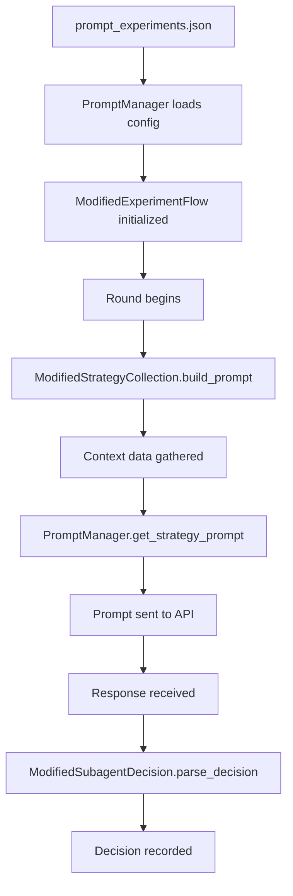

# 🗺️ ULTRATHINK Prompt Usage Map

This document maps all locations where prompts are constructed, modified, and used throughout the ULTRATHINK framework.

## 📍 Prompt Definition Files

### 1. **`prompt_experiments.json`**
- **Location**: `/prompt_experiments.json`
- **Purpose**: Defines 12 different prompt experiment configurations
- **Key Fields**:
  - `include_identity`: Whether to include identity information
  - `include_global_cooperation`: Whether to show cooperation statistics
  - `include_round_summaries`: Whether to show round history
  - `default_on_ambiguity`: What to do with unclear responses
  - `fallback_strategy`: Default strategy when errors occur

### 2. **`aises_experiments.json`** (if exists)
- **Location**: `/aises_experiments.json`
- **Purpose**: Defines AISES-aligned graduated difficulty experiments
- **Contains**: One-shot and iterated game prompt configurations

## 🏗️ Prompt Construction Classes

### 1. **`PromptManager`**
- **Location**: `src/core/prompt_manager.py`
- **Key Methods**:
  ```python
  get_strategy_prompt(context: Dict) -> str  # Lines: ~50-120
  get_decision_prompt(context: Dict) -> str  # Lines: ~130-180
  get_fallback_strategy() -> str            # Lines: ~190-200
  get_default_action() -> str               # Lines: ~210-220
  ```

### 2. **`ModifiedStrategyCollection`**
- **Location**: `run_prompt_experiment.py:351-389`
- **Method**: `build_prompt(agent, round_num, round_summaries)`
- **Purpose**: Overrides base prompt building with experimental variations

### 3. **`ModifiedSubagentDecision`**
- **Location**: `run_prompt_experiment.py:415-440`
- **Method**: `parse_decision(response)`
- **Purpose**: Handles ambiguous responses based on experiment config

## 📤 Prompt Sending Points

### 1. **Strategy Collection Phase**
- **File**: `src/nodes/strategy_collection.py`
- **Method**: `collect_strategies()` (Lines: ~80-150)
- **API Call Location**: Lines ~120-130
  ```python
  response = await self.api_client.get_completion_text(
      prompt=self.build_prompt(agent, round_num, round_summaries),
      model=model,
      temperature=0.7
  )
  ```

### 2. **Subagent Decision Phase**
- **File**: `src/nodes/subagent_decision.py`
- **Method**: `get_decision()` (Lines: ~60-120)
- **API Call Location**: Lines ~90-100
  ```python
  response = await self.api_client.get_completion_text(
      prompt=decision_prompt,
      model=model,
      temperature=0.7
  )
  ```

### 3. **One-Shot Experiments**
- **File**: `run_aises_experiments.py`
- **Method**: `OneShotRunner._get_decision()` (Lines: ~90-120)
- **API Call Location**: Lines ~100-110

### 4. **Finite Game Experiments**
- **File**: `run_aises_experiments.py`
- **Method**: `FiniteGameRunner._get_decision()` (Lines: ~300-320)
- **API Call Location**: Lines ~306-315

## 🔄 Prompt Flow Through System



## 📝 Prompt Template Locations

### 1. **Base Strategy Prompt Template**
- **File**: `src/core/prompt_manager.py`
- **Lines**: ~50-70
- **Template Structure**:
  ```python
  base_prompt = """
  You are Agent {agent_id} in a multi-round prisoner's dilemma tournament.
  {identity_section}
  {cooperation_section}
  {history_section}
  Choose your strategy...
  """
  ```

### 2. **Decision Prompt Template**
- **File**: `src/nodes/subagent_decision.py`
- **Lines**: ~40-50
- **Template Structure**:
  ```python
  decision_prompt = """
  You declared strategy: {strategy}
  Opponent declared: {opponent_strategy}
  Now make your decision: COOPERATE or DEFECT
  """
  ```

### 3. **One-Shot Prompt Templates**
- **File**: `run_aises_experiments.py`
- **Lines**: ~50-80
- **Variants**:
  - No information prompt
  - Similar LLM prompt
  - Human opponent prompt
  - Identical agent prompt

## 🎛️ Prompt Modification Points

### 1. **Context Injection**
- **Location**: `run_prompt_experiment.py:359-386`
- **Variables Added**:
  - `coop_rate`: Current cooperation percentage
  - `distribution`: Score statistics
  - `previous_rounds_detail`: Historical data

### 2. **Anonymization**
- **File**: `src/utils/anonymization.py`
- **Method**: `anonymize_prompt()`
- **Purpose**: Replaces agent IDs with anonymous labels

### 3. **Model-Specific Formatting**
- **File**: `src/core/api_client.py`
- **Method**: `format_for_model()` (Lines: ~150-180)
- **Purpose**: Adjusts prompt format for different AI models

## 🔍 Prompt Analysis & Logging

### 1. **Prompt Logging**
- **File**: `src/nodes/strategy_collection.py`
- **Lines**: ~115-118
- **Logs**: Every prompt sent and response received

### 2. **Prompt Effect Analysis**
- **File**: `analyze_prompt_effects.py`
- **Purpose**: Analyzes how different prompts affect cooperation
- **Key Functions**:
  - `analyze_bias_effects()` (Lines: ~100-200)
  - `analyze_framing_effects()` (Lines: ~210-300)

### 3. **Cached Prompts**
- **Directory**: `results/.cache/`
- **Format**: Prompts stored with experiment results for analysis

## 🚨 Critical Prompt Locations

These are the most important files to examine when understanding prompt behavior:

1. **Primary Construction**: `src/core/prompt_manager.py:get_strategy_prompt()`
2. **Experimental Override**: `run_prompt_experiment.py:ModifiedStrategyCollection.build_prompt()`
3. **API Sending**: `src/nodes/strategy_collection.py:collect_strategies()`
4. **Response Parsing**: `run_prompt_experiment.py:ModifiedSubagentDecision.parse_decision()`
5. **Configuration**: `prompt_experiments.json`

## 📊 Prompt Metrics Collection

### 1. **Cooperation Rate Calculation**
- **File**: `src/core/models.py`
- **Class**: `RoundSummary` (Lines: ~120-180)
- **Tracks**: How prompts affect cooperation percentages

### 2. **Strategy Distribution**
- **File**: `src/utils/data_manager.py`
- **Method**: `save_strategies()` (Lines: ~200-250)
- **Records**: Which strategies prompts elicit

### 3. **Ambiguity Tracking**
- **File**: `run_prompt_experiment.py`
- **Lines**: ~425-438
- **Logs**: When responses are ambiguous and defaults are used

## 🔧 Debugging Prompt Issues

To trace a prompt through the system:

1. **Start**: Check experiment config in `prompt_experiments.json`
2. **Load**: Verify loading in `PromptManager.__init__()`
3. **Build**: Debug in `ModifiedStrategyCollection.build_prompt()`
4. **Send**: Log in `strategy_collection.py:collect_strategies()`
5. **Response**: Check `ModifiedSubagentDecision.parse_decision()`
6. **Analysis**: Review in `analyze_prompt_effects.py`

## 📚 Related Documentation

- [PROMPT_EXPERIMENTS.md](PROMPT_EXPERIMENTS.md) - Detailed experiment descriptions
- [README.md](README.md) - Overview of bias issues
- [AISES_RESPONSE.md](AISES_RESPONSE.md) - Academic methodology

---

*Last Updated: 2025-09-08*
*Framework Version: ULTRATHINK v2.0*