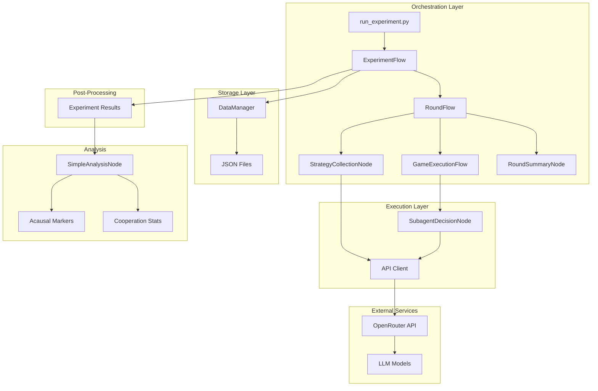
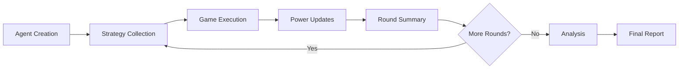
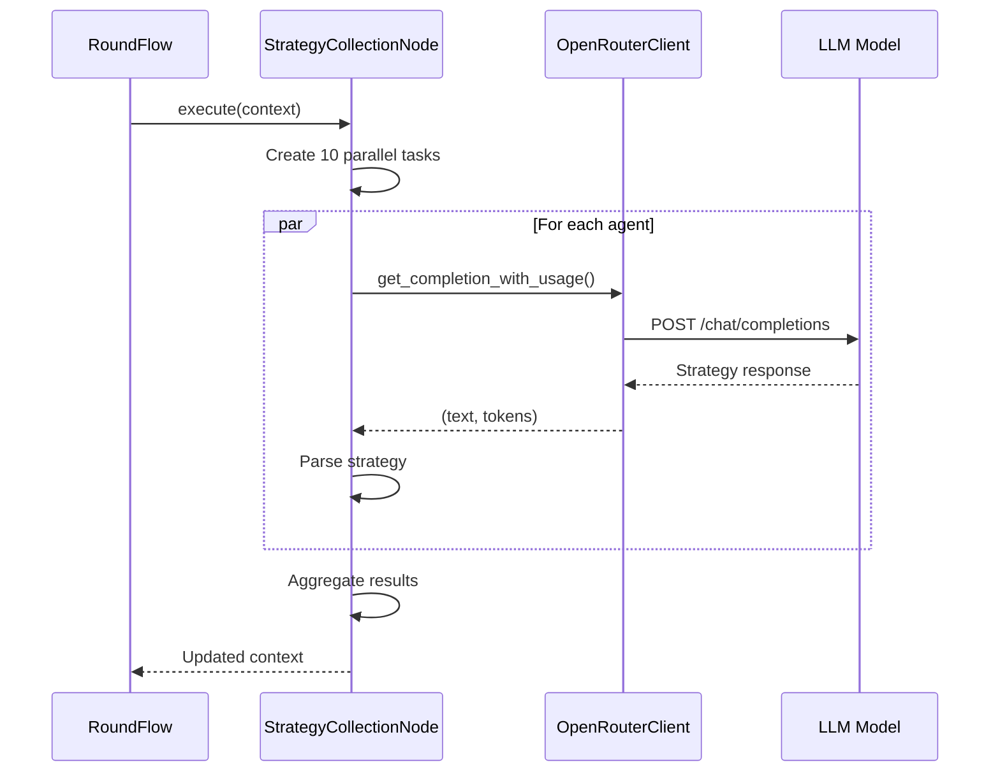
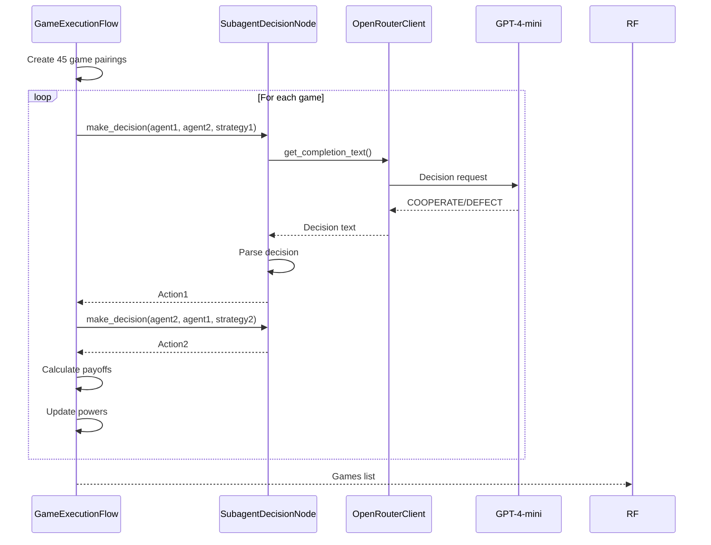
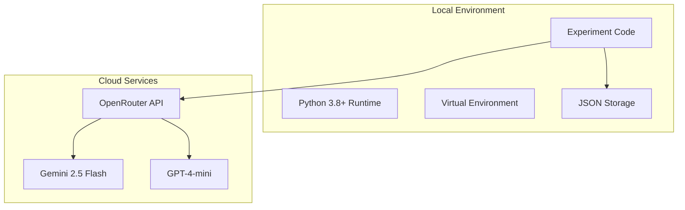
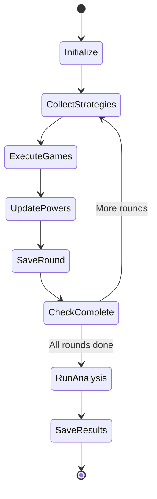
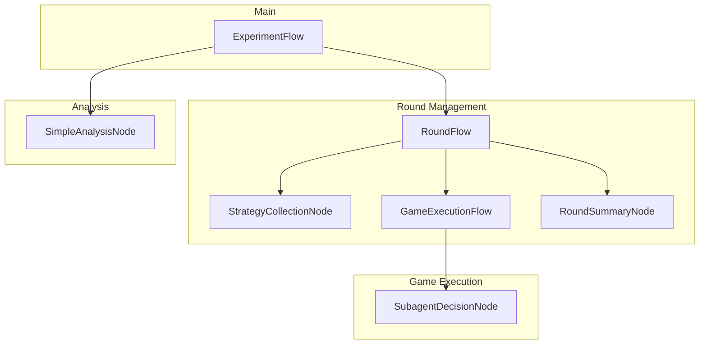
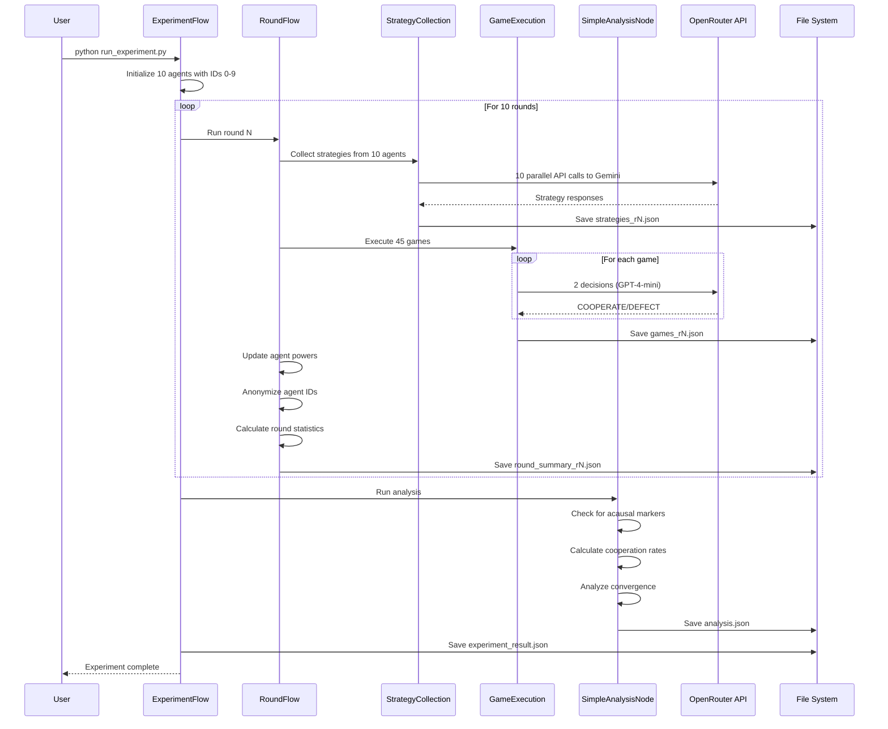

# System Architecture Document

## Document Control
| Version | Date | Author | Description |
|---------|------|--------|-------------|
| 1.0 | 2025-07-14 | System | Initial architecture design |
| 1.1 | 2025-07-28 | System | Added analysis node details |
| 2.0 | 2025-08-18 | System | Simplified to match PRD scope |

## Executive Summary

The Acausal Cooperation Experiment system implements a controlled environment for testing superrational cooperation between identical AI agents in prisoner's dilemma tournaments. The architecture prioritizes simplicity, maintainability, and alignment with research goals while avoiding over-engineering.

## System Context

The system orchestrates interactions between 10 identical LLM agents over 10 rounds of prisoner's dilemma games, collecting strategies and game outcomes to analyze for patterns of acausal cooperation.

## High Level Architecture

### Technical Summary

The Acausal Cooperation Experiment employs a modular Python-based architecture using an async flow framework to orchestrate prisoner's dilemma tournaments between LLM agents. The system leverages OpenRouter API for LLM access, implements a hierarchical node-based execution pattern for experiment orchestration, and outputs comprehensive JSON datasets for analysis. The architecture prioritizes simplicity, clear separation of concerns, and robust data collection to enable statistical analysis of superrational cooperation patterns. This design achieves the PRD goals by providing a controlled experimental environment with minimal external dependencies.

### Platform and Infrastructure Choice

**Platform:** Local Python Environment with Cloud API Access
- Chosen for rapid development and iteration
- No infrastructure management overhead
- Direct control over execution and debugging

**API Provider:** OpenRouter
- Unified access to multiple LLM models through single API
- Simplified billing and rate limiting
- Consistent interface across different model providers

**Storage:** Local JSON Files
- Simple, human-readable format
- No database complexity for small datasets
- Easy version control and sharing

### System Architecture Diagram



### Architectural Patterns

1. **Node-Based Execution**: Each major operation is encapsulated in a node with standard interfaces
2. **Async/Await Concurrency**: Parallel API calls for strategy collection
3. **Flow Orchestration**: Hierarchical flows manage complex multi-step processes
4. **Separation of Concerns**: Clear boundaries between orchestration, execution, and storage

## Data Model Design

### Core Entities

#### Agent
**Purpose:** Represents a participant in the experiment

**Attributes:**
- id: int - Unique identifier (0-9)
- power: float - Current power level (50-150)
- strategy: str - Current round strategy
- total_score: float - Accumulated score

#### TypeScript Interface
```typescript
interface Agent {
  id: number;
  power: number;
  strategy: string;
  total_score: number;
}
```

#### Relationships
- Has many StrategyRecords (one per round)
- Participates in many GameResults

#### Validation Rules
- ID must be between 0 and 9
- Power must be between 50 and 150
- Strategy cannot be empty after round 1

---

#### GameResult
**Purpose:** Records the outcome of a single prisoner's dilemma game

**Attributes:**
- game_id: str - Unique game identifier
- round: int - Round number (1-10)
- player1_id: int - First player's agent ID
- player2_id: int - Second player's agent ID
- player1_action: str - COOPERATE or DEFECT
- player2_action: str - COOPERATE or DEFECT
- player1_payoff: float - Points earned by player 1
- player2_payoff: float - Points earned by player 2
- player1_power_before: float - Player 1's power before game
- player2_power_before: float - Player 2's power before game
- timestamp: str - ISO timestamp

#### TypeScript Interface
```typescript
interface GameResult {
  game_id: string;
  round: number;
  player1_id: number;
  player2_id: number;
  player1_action: "COOPERATE" | "DEFECT";
  player2_action: "COOPERATE" | "DEFECT";
  player1_payoff: number;
  player2_payoff: number;
  player1_power_before: number;
  player2_power_before: number;
  timestamp: string;
}
```

#### Relationships
- References two Agents
- Belongs to one Round

#### Validation Rules
- Actions must be either "COOPERATE" or "DEFECT"
- Player IDs must be different
- Round must be between 1 and 10

---

#### StrategyRecord
**Purpose:** Stores the full strategy reasoning from main agents

**Attributes:**
- strategy_id: str - Unique identifier
- agent_id: int - Agent who created strategy
- round: int - Round number
- strategy_text: str - Extracted strategy
- full_reasoning: str - Complete LLM response
- prompt_tokens: int - Tokens used in prompt
- completion_tokens: int - Tokens in response
- model: str - Model used
- timestamp: str - ISO timestamp

#### TypeScript Interface
```typescript
interface StrategyRecord {
  strategy_id: string;
  agent_id: number;
  round: number;
  strategy_text: string;
  full_reasoning: string;
  prompt_tokens: number;
  completion_tokens: number;
  model: string;
  timestamp: string;
}
```

#### Relationships
- Belongs to one Agent
- Created once per round

---

#### RoundSummary

**Purpose:** Aggregated statistics and anonymized results for a complete round

**Attributes:**
- round: int - Round number (1-10)
- cooperation_rate: float - Percentage of COOPERATE actions
- average_score: float - Mean score across all agents
- score_variance: float - Variance in scores
- power_distribution: dict - Statistics on power levels
- anonymized_games: list - Games with anonymized agent IDs

#### TypeScript Interface
```typescript
interface RoundSummary {
  round: number;
  cooperation_rate: number;
  average_score: number;
  score_variance: number;
  power_distribution: {
    mean: number;
    std: number;
    min: number;
    max: number;
  };
  anonymized_games: AnonymizedGameResult[];
}
```

#### Relationships
- Has many AnonymizedGameResults
- Belongs to one Experiment

---

#### ExperimentResult
**Purpose:** Complete experiment data including all rounds and analysis

**Attributes:**
- experiment_id: str - Unique experiment identifier
- start_time: str - ISO timestamp
- end_time: str - ISO timestamp
- total_rounds: int - Number of rounds completed
- total_games: int - Total games played
- total_api_calls: int - API calls made
- total_cost: float - Estimated cost in USD
- round_summaries: list - All round summaries
- acausal_indicators: dict - Analysis metrics

#### TypeScript Interface
```typescript
interface ExperimentResult {
  experiment_id: string;
  start_time: string;
  end_time: string;
  total_rounds: number;
  total_games: number;
  total_api_calls: number;
  total_cost: number;
  round_summaries: RoundSummary[];
  acausal_indicators: {
    identity_reasoning_frequency: number;
    cooperation_despite_asymmetry: number;
    strategy_convergence: number;
    overall_cooperation_rate: number;
    acausal_score: number;
  };
}
```

#### Relationships
- Has many RoundSummaries
- Has many StrategyRecords
- Has many GameResults

### Data Flow



## Component Design

### Core Components

### ExperimentFlow

**Responsibility:** Top-level orchestration of the complete experiment

**Key Interfaces:**
- `async def run() -> ExperimentResult` - Main entry point
- `def save_results(filename: str)` - Persist experiment data
- `def get_cost_estimate() -> float` - Track API costs

**Dependencies:** RoundFlow, SimpleAnalysisNode, OpenRouterClient

**Technology Stack:** Python asyncio, custom AsyncFlow base class

### RoundFlow

**Responsibility:** Orchestrates a single round of the tournament

**Key Interfaces:**
- `async def run(context: dict) -> dict` - Execute round
- `def get_round_summary() -> RoundSummary` - Generate summary

**Dependencies:** StrategyCollectionNode, GameExecutionFlow, RoundSummaryNode

**Technology Stack:** AsyncFlow pattern, context passing

### StrategyCollectionNode

**Responsibility:** Collect strategies from all agents in parallel

**Key Interfaces:**
- `async def execute(context: dict) -> dict` - Collect all strategies
- `async def process_item(agent: Agent) -> StrategyRecord` - Process single agent

**Dependencies:** OpenRouterClient, prompt templates

**Technology Stack:** AsyncParallelBatchNode, concurrent execution

### GameExecutionFlow

**Responsibility:** Execute all games in a round (round-robin tournament)

**Key Interfaces:**
- `async def run(context: dict) -> dict` - Execute all games
- `def create_pairings(agents: List[Agent]) -> List[tuple]` - Generate matchups

**Dependencies:** SubagentDecisionNode, game logic

**Technology Stack:** Async game orchestration, payoff calculations

### SubagentDecisionNode

**Responsibility:** Make COOPERATE/DEFECT decisions based on strategies

**Key Interfaces:**
- `async def make_decision(agent: Agent, opponent: Agent, strategy: str) -> str`
- `def parse_decision(response: str) -> str` - Extract decision from LLM

**Dependencies:** OpenRouterClient, response parser

**Technology Stack:** AsyncNode base class, lightweight prompting

### SimpleAnalysisNode

**Responsibility:** Performs basic analysis as specified in PRD: cooperation rates, acausal markers, and convergence

**Key Interfaces:**
- `async def _execute_impl(context: Dict[str, Any]) -> Dict[str, Any]` - Main analysis execution
- `def _analyze_cooperation(round_summaries: List[RoundSummary]) -> Dict` - Calculate cooperation statistics
- `def _check_acausal_markers(strategies: List[StrategyRecord]) -> Dict` - Search for identity reasoning keywords
- `def _analyze_strategy_convergence(strategies: List[StrategyRecord], round_summaries: List[RoundSummary]) -> Dict` - Check convergence

**Dependencies:** numpy for basic statistics

**Technology Stack:** Python, basic statistical analysis

### Simple Analysis Pipeline

The analysis focuses on detecting acausal cooperation patterns for the paper:

1. **Identity Reasoning Detection**
   - Search for keywords: "identical", "same agent", "copy", "acausal", "superrational"
   - Count frequency across all strategies
   - Generate acausal_score metric

2. **Cooperation Analysis**
   - Calculate average cooperation rate
   - Track cooperation trend (increasing/decreasing)
   - Identify peak and lowest cooperation rounds

3. **Strategy Convergence**
   - Compare variance in first vs second half of rounds
   - Detect if strategies are converging to similar patterns
   - Calculate convergence strength metric

```python
class SimpleAnalysisNode:
    def analyze_cooperation_patterns(self, all_games: List[dict]) -> dict:
        """Calculate cooperation statistics"""
        cooperation_by_round = defaultdict(list)
        for game in all_games:
            round_num = game['round']
            cooperation_by_round[round_num].append(
                1 if game['player1_action'] == 'COOPERATE' else 0
            )
            cooperation_by_round[round_num].append(
                1 if game['player2_action'] == 'COOPERATE' else 0
            )
        
        return {
            'average_cooperation': np.mean([np.mean(v) for v in cooperation_by_round.values()]),
            'cooperation_trend': 'increasing' if rates[-1] > rates[0] else 'decreasing'
        }
```

### DataManager

**Responsibility:** Handle all file I/O operations for experiment data

**Key Interfaces:**
- `def save_strategies(round_num: int, strategies: List[StrategyRecord])`
- `def save_games(round_num: int, games: List[GameResult])`
- `def save_experiment_result(result: ExperimentResult)`
- `def get_experiment_path() -> Path` - Get experiment directory

**Dependencies:** pathlib, json

**Technology Stack:** JSON serialization, file system operations

### OpenRouterClient

**Responsibility:** Manage all API interactions with OpenRouter

**Key Interfaces:**
- `async def complete(messages: list, model: str, **kwargs) -> dict`
- `async def get_completion_text(messages: list, model: str, **kwargs) -> str`
- `async def get_completion_with_usage(messages: list, model: str, **kwargs) -> tuple`

**Dependencies:** aiohttp

**Technology Stack:** Async HTTP client, rate limiting

## Technical Architecture

### Sequence Diagrams

#### Strategy Collection Sequence



#### Game Execution Sequence



### Deployment Architecture



### State Flow



## Component Interactions

### Flow Hierarchy



### Context Flow

The system uses a shared context dictionary that flows through all components:

```python
context = {
    'experiment_id': str,
    'round': int,
    'agents': List[Agent],
    'strategies': List[StrategyRecord],
    'games': List[GameResult],
    'round_summaries': List[RoundSummary],
    'config': Config
}
```

## Detailed Sequence Flows

### Complete Experiment Flow



## API Integration

### OpenRouter Integration

```python
class OpenRouterClient:
    BASE_URL = "https://openrouter.ai/api/v1/chat/completions"
    
    async def complete(self, messages: list, model: str, **kwargs):
        """Make completion request to OpenRouter"""
        payload = {
            "model": model,
            "messages": messages,
            "temperature": kwargs.get("temperature", 0.7),
            "max_tokens": kwargs.get("max_tokens", 1000)
        }
        
        async with self.session.post(
            self.BASE_URL,
            headers=self.headers,
            json=payload
        ) as response:
            return await response.json()
```

### Rate Limiting Strategy

- Simple token bucket algorithm
- 60 requests per minute limit
- Exponential backoff on 429 errors
- Parallel requests for strategy collection
- Sequential requests for game decisions

## Data Persistence

### File Structure

```
results/
└── exp_20250714_120000_abc123/
    ├── strategies/
    │   ├── strategies_r1.json
    │   ├── strategies_r2.json
    │   └── ...
    ├── games/
    │   ├── games_r1.json
    │   ├── games_r2.json
    │   └── ...
    ├── summaries/
    │   ├── round_summary_r1.json
    │   ├── round_summary_r2.json
    │   └── ...
    ├── experiment_result.json
    └── analysis.json
```

### JSON Schema Examples

#### Strategy Record
```json
{
  "strategy_id": "strat_0_r1_abc123",
  "agent_id": 0,
  "round": 1,
  "strategy_text": "Always cooperate in round 1",
  "full_reasoning": "Since we are all identical agents...",
  "prompt_tokens": 150,
  "completion_tokens": 75,
  "model": "google/gemini-2.5-flash",
  "timestamp": "2025-07-14T12:00:00Z"
}
```

#### Game Result
```json
{
  "game_id": "game_r1_0v1_abc123",
  "round": 1,
  "player1_id": 0,
  "player2_id": 1,
  "player1_action": "COOPERATE",
  "player2_action": "COOPERATE",
  "player1_payoff": 3.0,
  "player2_payoff": 3.0,
  "player1_power_before": 100.0,
  "player2_power_before": 100.0,
  "timestamp": "2025-07-14T12:01:00Z"
}
```

#### Round Summary
```json
{
  "round": 1,
  "cooperation_rate": 0.8,
  "average_score": 2.7,
  "score_variance": 0.5,
  "power_distribution": {
    "mean": 100.5,
    "std": 2.3,
    "min": 95.2,
    "max": 105.8
  },
  "anonymized_games": [
    {
      "anonymous_id1": "Agent_123",
      "anonymous_id2": "Agent_456",
      "action1": "COOPERATE",
      "action2": "DEFECT",
      "power_ratio": 1.05
    }
  ]
}
```

## Implementation

### Directory Structure

```
acausal/
├── nodes/
│   ├── __init__.py
│   ├── base.py                    # AsyncNode, AsyncFlow base classes
│   ├── strategy_collection.py     # StrategyCollectionNode
│   ├── subagent_decision.py      # SubagentDecisionNode
│   └── simple_analysis.py        # SimpleAnalysisNode
├── flows/
│   ├── __init__.py
│   ├── experiment.py             # ExperimentFlow
│   ├── round.py                  # RoundFlow
│   └── game_execution.py         # GameExecutionFlow
├── core/
│   ├── __init__.py
│   ├── models.py                 # Data models (Agent, GameResult, etc.)
│   ├── config.py                 # Configuration
│   └── api_client.py             # OpenRouterClient
├── utils/
│   ├── __init__.py
│   ├── data_manager.py           # JSON file I/O
│   └── anonymizer.py             # Round result anonymization
└── run_experiment.py             # Main entry point
```

#### Node Base Classes

```python
class AsyncNode(ABC):
    """Base class for async operations with retry logic"""
    
    @abstractmethod
    async def _execute_impl(self, context: dict) -> dict:
        """Implementation to be provided by subclasses"""
        pass
    
    async def execute(self, context: dict) -> dict:
        """Execute with retry logic"""
        for attempt in range(self.max_retries):
            try:
                return await self._execute_impl(context)
            except Exception as e:
                if attempt < self.max_retries - 1:
                    await asyncio.sleep(self.retry_delay * (2 ** attempt))
                else:
                    raise

class AsyncFlow:
    """Base class for orchestrating multiple nodes"""
    
    def add_node(self, node: AsyncNode) -> 'AsyncFlow':
        """Add node to flow"""
        self.nodes.append(node)
        return self
    
    async def run(self, context: dict) -> dict:
        """Run all nodes in sequence"""
        for node in self.nodes:
            context = await node.execute(context)
        return context
```

## Security Considerations

### API Key Management
- API keys stored in environment variables
- Never committed to version control
- .env file for local development

### Data Privacy
- Agent IDs anonymized between rounds
- No personally identifiable information collected
- Results stored locally only

### Rate Limiting
- Respect API provider limits
- Exponential backoff on errors
- Cost monitoring with $10 limit

## Performance Considerations

### Optimization Strategies
1. **Parallel Strategy Collection**: 10 concurrent API calls per round
2. **Sequential Game Execution**: Avoid rate limiting on decisions
3. **Batch File Writes**: Save all round data at once
4. **Memory Management**: Clear context between rounds

### Scalability Limits
- Maximum 10 agents (PRD requirement)
- Maximum 10 rounds (PRD requirement)
- ~1000 API calls per experiment
- ~100MB storage per experiment

## Testing Strategy

### Unit Tests
- Test each node independently
- Mock API responses
- Validate data models

### Integration Tests
- Test complete round flow
- Test file I/O operations
- Test error recovery

### End-to-End Tests
- Run mini experiments (2 agents, 2 rounds)
- Validate output formats
- Check analysis accuracy

## Maintenance and Operations

### Monitoring
- Console logging for progress
- Error logs for debugging
- Cost tracking per experiment

### Error Recovery
- Retry logic for API failures
- Partial result saving
- Graceful shutdown on Ctrl+C

### Future Extensibility Points
- Plugin system for new analysis methods
- Alternative API providers
- Database storage option
- Web dashboard (explicitly out of scope for v1)

## Appendices

### A. Glossary
- **Agent**: An LLM instance participating in the experiment
- **Round**: One complete set of games between all agents
- **Game**: Single prisoner's dilemma interaction
- **Strategy**: Agent's plan for playing games
- **Acausal Cooperation**: Cooperation based on logical correlation rather than causal influence

### B. References
- PRD: Product Requirements Document
- OpenRouter API Documentation
- Prisoner's Dilemma Game Theory

### C. Change Log
| Date | Version | Changes | Author |
|------|---------|---------|--------|
| 2025-07-14 | 1.0 | Initial architecture | System |
| 2025-07-28 | 1.1 | Added analysis details | System |
| 2025-08-18 | 2.0 | Simplified to PRD scope | System |