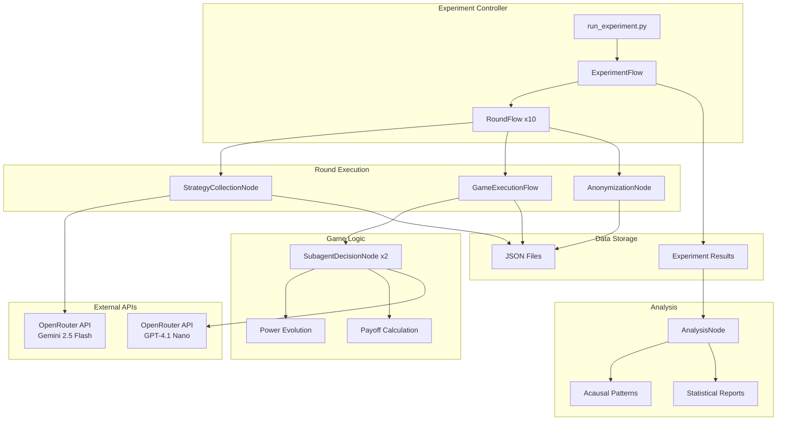
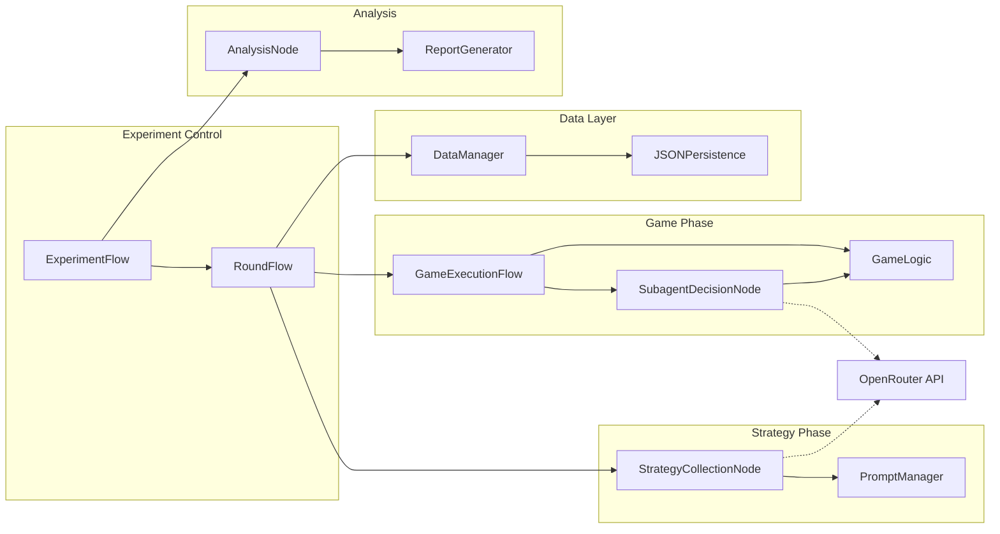
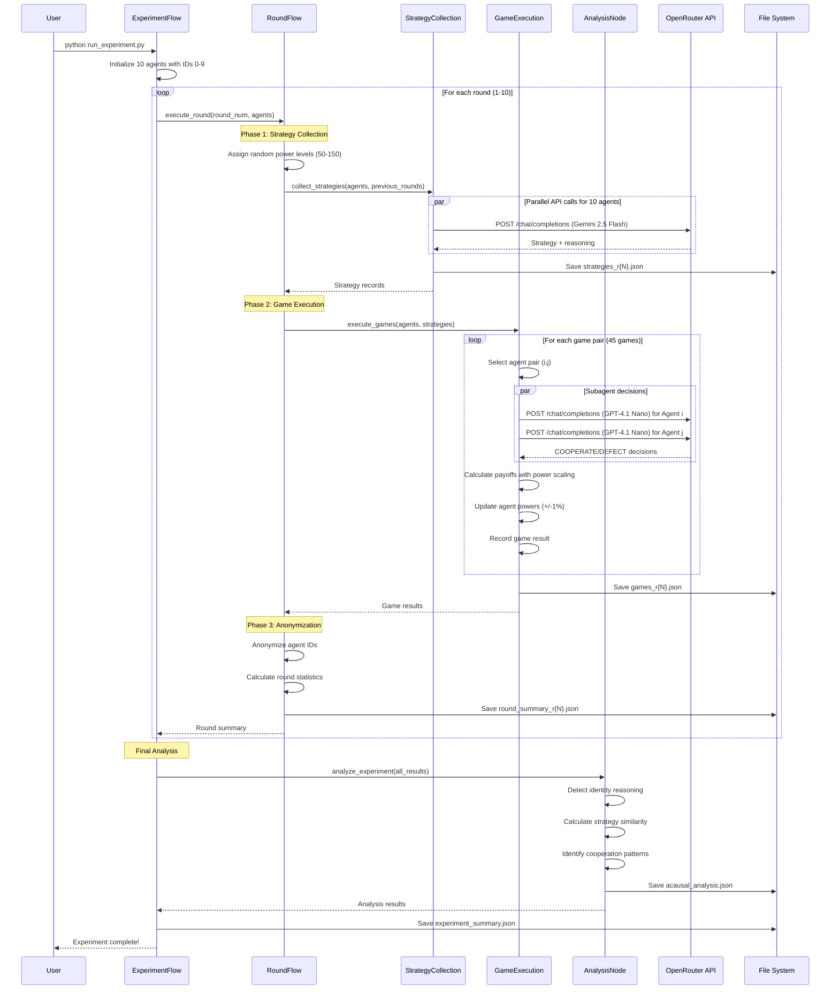
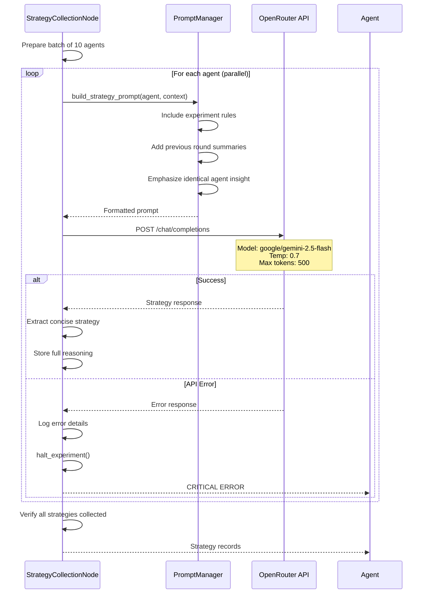
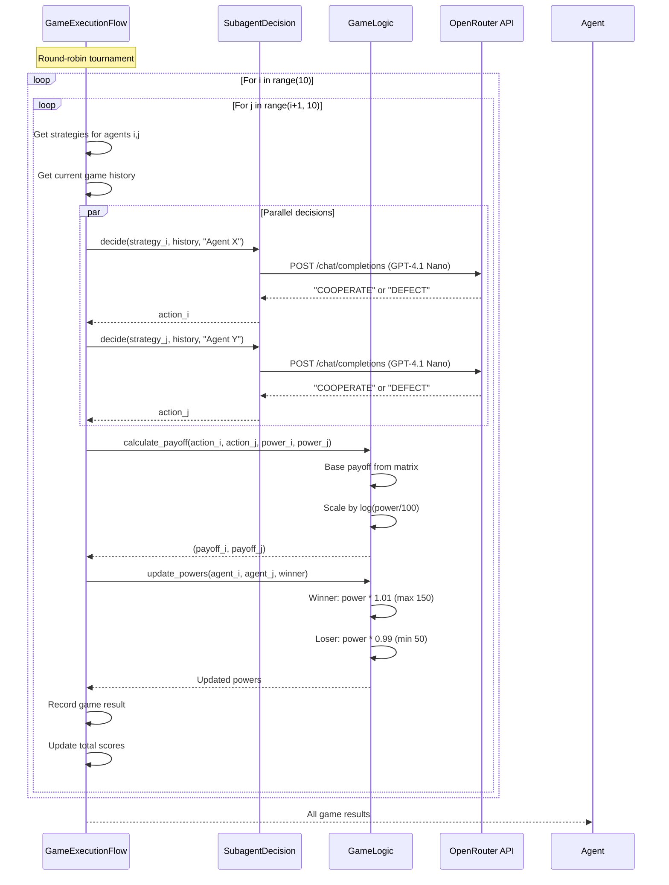
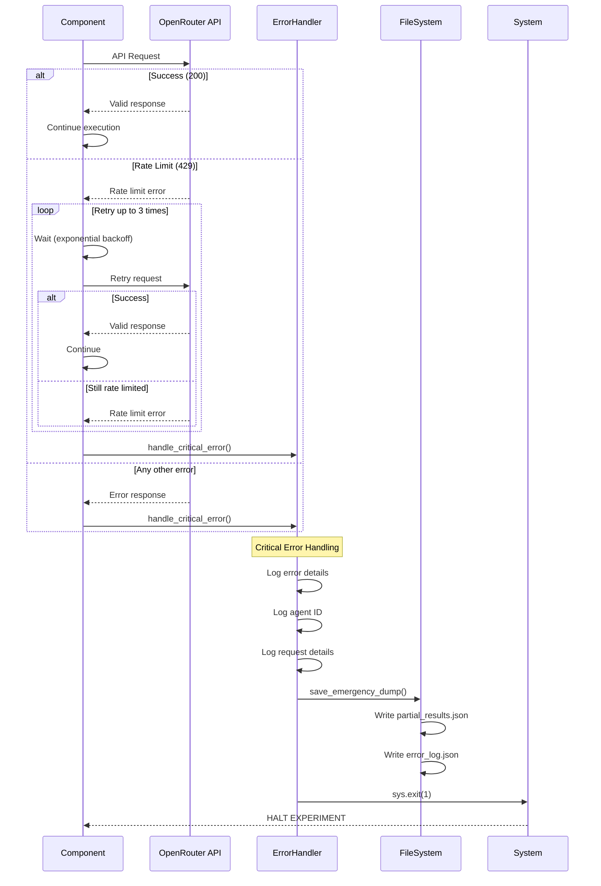

# Acausal Cooperation Experiment Fullstack Architecture Document

## Introduction

This document outlines the complete fullstack architecture for Acausal Cooperation Experiment, including backend systems, frontend implementation, and their integration. It serves as the single source of truth for AI-driven development, ensuring consistency across the entire technology stack.

This unified approach combines what would traditionally be separate backend and frontend architecture documents, streamlining the development process for modern fullstack applications where these concerns are increasingly intertwined.

### Starter Template or Existing Project

N/A - Greenfield project

### Change Log

| Date | Version | Description | Author |
|------|---------|-------------|--------|
| 2025-07-29 | 1.0 | Initial architecture document | Winston |

## High Level Architecture

### Technical Summary

The Acausal Cooperation Experiment employs a modular Python-based architecture using an async flow framework to orchestrate prisoner's dilemma tournaments between LLM agents. The system leverages OpenRouter API for multi-model LLM access, implements a hierarchical node-based execution pattern for experiment orchestration, and outputs comprehensive JSON datasets for analysis. The architecture prioritizes simplicity, clear separation of concerns, and robust data collection to enable statistical analysis of superrational cooperation patterns. This design achieves the PRD goals by providing a controlled experimental environment with minimal external dependencies while maintaining flexibility for future experiments.

### Platform and Infrastructure Choice

**Platform:** Local Python Environment with Cloud API Access
**Key Services:** OpenRouter API (LLM access), Local filesystem (data storage), Python async runtime
**Deployment Host and Regions:** Local development machine with internet access for API calls

### Repository Structure

**Structure:** Single Python Project (Simple Structure)
**Monorepo Tool:** N/A - Single project structure
**Package Organization:** Modular Python packages organized by functionality (nodes, flows, analysis)

### High Level Architecture Diagram



### Architectural Patterns

- **Async Flow Pattern:** Hierarchical async flows orchestrate experiment phases - _Rationale:_ Enables parallel API calls and clean separation of experiment phases
- **Node-Based Architecture:** Each logical operation encapsulated in a node class - _Rationale:_ Promotes reusability, testability, and clear boundaries between components
- **Strategy-Executor Separation:** Main agents create strategies, subagents execute them - _Rationale:_ Mimics real-world delegation and prevents direct game-playing by strategy agents
- **Immutable Game History:** Append-only game records with anonymization layer - _Rationale:_ Ensures experimental integrity while protecting agent identity for unbiased decisions
- **JSON-First Data Storage:** All outputs stored as structured JSON files - _Rationale:_ Enables easy analysis with standard tools and preserves complete experimental data
- **Stateless API Integration:** Each API call is independent with retry logic - _Rationale:_ Handles API failures gracefully without corrupting experiment state

## Tech Stack

### Technology Stack Table

| Category | Technology | Version | Purpose | Rationale |
|----------|------------|---------|----------|-----------|
| Frontend Language | N/A | - | No frontend needed | Console-based research experiment |
| Frontend Framework | N/A | - | No frontend needed | Pure backend experiment |
| UI Component Library | N/A | - | No UI required | Command-line execution only |
| State Management | Python dict/dataclass | 3.11+ | Maintain experiment state | Simple, built-in solution for research |
| Backend Language | Python | 3.11+ | Core implementation | Excellent async support and data science ecosystem |
| Backend Framework | Custom Async Nodes | 1.0 | Flow orchestration | Lightweight, purpose-built for experiment |
| API Style | REST (OpenRouter) | - | LLM API access | OpenRouter provides unified access to multiple models |
| Database | JSON Files | - | Data persistence | Simple, portable, human-readable experiment data |
| Cache | In-memory dict | - | API response caching | Reduce duplicate API calls within rounds |
| File Storage | Local filesystem | - | Experiment outputs | Direct access for analysis scripts |
| Authentication | API Key (OpenRouter) | - | LLM API access | Simple header-based authentication |
| Frontend Testing | N/A | - | No frontend | Not applicable |
| Backend Testing | pytest | 7.x | Unit and integration tests | Standard Python testing framework |
| E2E Testing | Custom experiment runner | - | Full experiment validation | Built-in experiment verification |
| Build Tool | None required | - | Pure Python | No build step needed |
| Bundler | N/A | - | No bundling needed | Single Python project |
| IaC Tool | N/A | - | Local execution | No infrastructure to provision |
| CI/CD | GitHub Actions | - | Automated testing | Simple workflow for tests |
| Monitoring | Console logging | - | Experiment progress | Real-time progress tracking |
| Logging | Python logging + JSON | - | Detailed experiment logs | Structured logs for debugging |
| CSS Framework | N/A | - | No UI | Not applicable |

## Data Models

### Agent

**Purpose:** Represents a participant in the experiment with unique identity and evolving power level

**Key Attributes:**
- id: int - Unique identifier (0-9)
- power: float - Current power level (50-150)
- strategy: str - Current round strategy text
- total_score: float - Cumulative payoff across all games

#### TypeScript Interface
```typescript
interface Agent {
  id: number;
  power: number;
  strategy: string;
  total_score: number;
}
```

#### Relationships
- Has many GameResults (as player1 or player2)
- Has many StrategyRecords
- Participates in Rounds

### GameResult

**Purpose:** Records the outcome of a single prisoner's dilemma game between two agents

**Key Attributes:**
- game_id: str - Unique identifier (round_game format)
- round: int - Round number (1-10)
- player1_id: int - First agent ID
- player2_id: int - Second agent ID
- player1_action: str - COOPERATE or DEFECT
- player2_action: str - COOPERATE or DEFECT
- player1_payoff: float - Calculated payoff for player1
- player2_payoff: float - Calculated payoff for player2
- player1_power_before: float - Power level before game
- player2_power_before: float - Power level before game
- timestamp: str - ISO timestamp of game execution

#### TypeScript Interface
```typescript
interface GameResult {
  game_id: string;
  round: number;
  player1_id: number;
  player2_id: number;
  player1_action: 'COOPERATE' | 'DEFECT';
  player2_action: 'COOPERATE' | 'DEFECT';
  player1_payoff: number;
  player2_payoff: number;
  player1_power_before: number;
  player2_power_before: number;
  timestamp: string;
}
```

#### Relationships
- Belongs to Round
- References two Agents
- Used in AnonymizedGameResult

### StrategyRecord

**Purpose:** Stores the full strategy reasoning and decision from main agents

**Key Attributes:**
- strategy_id: str - Unique identifier
- agent_id: int - Agent who created strategy
- round: int - Round number
- strategy_text: str - Concise strategy for subagent
- full_reasoning: str - Complete LLM response with reasoning
- prompt_tokens: int - Tokens used in prompt
- completion_tokens: int - Tokens in response
- model: str - Model used (gemini-2.5-flash)
- timestamp: str - ISO timestamp

#### TypeScript Interface
```typescript
interface StrategyRecord {
  strategy_id: string;
  agent_id: number;
  round: number;
  strategy_text: string;
  full_reasoning: string;
  prompt_tokens: number;
  completion_tokens: number;
  model: string;
  timestamp: string;
}
```

#### Relationships
- Belongs to Agent
- Belongs to Round
- Influences GameResults in same round

### RoundSummary

**Purpose:** Aggregated statistics and anonymized results for a complete round

**Key Attributes:**
- round: int - Round number (1-10)
- cooperation_rate: float - Percentage of COOPERATE actions
- average_score: float - Mean score across all agents
- score_variance: float - Variance in scores
- power_distribution: dict - Statistics on power levels
- anonymized_games: list - Games with anonymized agent IDs
- strategy_similarity: float - Cosine similarity of strategies

#### TypeScript Interface
```typescript
interface RoundSummary {
  round: number;
  cooperation_rate: number;
  average_score: number;
  score_variance: number;
  power_distribution: {
    mean: number;
    std: number;
    min: number;
    max: number;
  };
  anonymized_games: AnonymizedGameResult[];
  strategy_similarity: number;
}
```

#### Relationships
- Has many AnonymizedGameResults
- Part of ExperimentResult
- Derived from GameResults and StrategyRecords

### ExperimentResult

**Purpose:** Complete experiment data including all rounds and final analysis

**Key Attributes:**
- experiment_id: str - Unique experiment identifier
- start_time: str - Experiment start timestamp
- end_time: str - Experiment end timestamp
- total_rounds: int - Number of rounds completed
- total_games: int - Total games played
- total_api_calls: int - API calls made
- total_cost: float - Estimated API cost
- round_summaries: list - All round summaries
- acausal_indicators: dict - Analysis results

#### TypeScript Interface
```typescript
interface ExperimentResult {
  experiment_id: string;
  start_time: string;
  end_time: string;
  total_rounds: number;
  total_games: number;
  total_api_calls: number;
  total_cost: number;
  round_summaries: RoundSummary[];
  acausal_indicators: {
    identity_reasoning_frequency: number;
    cooperation_despite_asymmetry: number;
    surprise_at_defection: number;
    strategy_convergence: number;
  };
}
```

#### Relationships
- Contains all RoundSummaries
- References all Agents
- Top-level container for experiment

## API Specification

### OpenRouter API Integration

Since this experiment consumes external LLM APIs rather than exposing its own API, this section documents the OpenRouter API integration patterns.

#### API Client Configuration
```python
class OpenRouterClient:
    BASE_URL = "https://openrouter.ai/api/v1"
    
    def __init__(self, api_key: str):
        self.api_key = api_key
        self.session = aiohttp.ClientSession()
        self.headers = {
            "Authorization": f"Bearer {api_key}",
            "Content-Type": "application/json",
            "HTTP-Referer": "https://github.com/acausal-experiment",
            "X-Title": "Acausal Cooperation Experiment"
        }
```

#### Strategy Collection Request
```python
# POST /chat/completions
{
    "model": "google/gemini-2.5-flash",
    "messages": [
        {
            "role": "system",
            "content": "You are participating in an experimental study on cooperation between AI systems."
        },
        {
            "role": "user",
            "content": "CRITICAL INSIGHT: You and all other participants are running identical copies...\n\nPrevious rounds showed:\n- Average cooperation rate: {coop_rate}%\n- Score distribution: {distribution}\n\nDesign a strategy for your subagent..."
        }
    ],
    "temperature": 0.7,
    "max_tokens": 500
}
```

#### Subagent Decision Request
```python
# POST /chat/completions
{
    "model": "gpt-4.1-nano",
    "messages": [
        {
            "role": "user",
            "content": "You are playing prisoner's dilemma. Your strategy:\n{strategy}\n\nGame history so far:\n{history}\n\nCurrent opponent: Agent {anonymous_id}\n\nDecision (COOPERATE/DEFECT):"
        }
    ],
    "temperature": 0.3,
    "max_tokens": 50
}
```

#### Response Handling
```python
async def make_api_call(self, request_data: dict, agent_id: int = None) -> dict:
    """Make API call with retry logic - fails fast on errors"""
    for attempt in range(3):
        try:
            async with self.session.post(
                f"{self.BASE_URL}/chat/completions",
                headers=self.headers,
                json=request_data
            ) as response:
                if response.status == 200:
                    data = await response.json()
                    return {
                        "content": data["choices"][0]["message"]["content"],
                        "usage": data["usage"],
                        "model": data["model"]
                    }
                elif response.status == 429:  # Rate limit
                    await asyncio.sleep(2 ** attempt)
                else:
                    self._handle_critical_error(
                        f"API returned {response.status}",
                        agent_id,
                        request_data
                    )
        except Exception as e:
            if attempt == 2:
                self._handle_critical_error(str(e), agent_id, request_data)
            await asyncio.sleep(1)

def _handle_critical_error(self, error: str, agent_id: int, request: dict):
    """Stop experiment immediately on any API failure"""
    print(f"\n🛑 CRITICAL ERROR - EXPERIMENT HALTED")
    print(f"Agent ID: {agent_id if agent_id else 'N/A'}")
    print(f"Model: {request.get('model')}")
    print(f"Error: {error}")
    print(f"Request: {json.dumps(request, indent=2)}")
    print(f"Timestamp: {datetime.now().isoformat()}")
    
    # Save partial results before exit
    self._save_emergency_dump()
    sys.exit(1)
```

#### Error Responses
```python
# Critical errors that halt experiment immediately
CRITICAL_ERRORS = {
    429: "Rate limit exceeded - check OpenRouter limits",
    401: "Invalid API key - verify OPENROUTER_API_KEY",
    400: "Invalid request - check model names",
    500: "OpenRouter server error",
    "timeout": "API request timeout",
    "parse_error": "Failed to parse API response"
}

## Components

### ExperimentFlow

**Responsibility:** Top-level orchestrator that manages the entire 10-round experiment lifecycle, tracks global state, and produces final analysis

**Key Interfaces:**
- `async def run() -> ExperimentResult` - Main entry point
- `def save_results(filename: str)` - Persist experiment data
- `def get_cost_estimate() -> float` - Track API costs

**Dependencies:** RoundFlow, AnalysisNode, OpenRouterClient

**Technology Stack:** Python asyncio, custom AsyncFlow base class

### RoundFlow

**Responsibility:** Manages single round execution including strategy collection, game execution, and result anonymization

**Key Interfaces:**
- `async def execute_round(round_num: int, agents: List[Agent]) -> RoundSummary`
- `def anonymize_results(games: List[GameResult]) -> List[AnonymizedGame]`
- `def calculate_round_stats(games: List[GameResult]) -> dict`

**Dependencies:** StrategyCollectionNode, GameExecutionFlow, Agent state management

**Technology Stack:** Python asyncio, numpy for statistics

### StrategyCollectionNode

**Responsibility:** Collects strategies from all 10 main agents in parallel using Gemini 2.5 Flash

**Key Interfaces:**
- `async def collect_strategies(agents: List[Agent], context: dict) -> List[StrategyRecord]`
- `def build_strategy_prompt(agent: Agent, history: dict) -> str`
- `def extract_strategy(response: str) -> str`

**Dependencies:** OpenRouterClient, prompt templates

**Technology Stack:** AsyncParallelBatchNode base class, aiohttp for concurrent API calls

### GameExecutionFlow

**Responsibility:** Executes 45 sequential games (round-robin tournament) and tracks power evolution

**Key Interfaces:**
- `def execute_games(agents: List[Agent], strategies: dict) -> List[GameResult]`
- `def update_power(agent: Agent, won: bool) -> float`
- `def calculate_payoff(action1: str, action2: str, power1: float, power2: float) -> tuple`

**Dependencies:** SubagentDecisionNode, game theory logic

**Technology Stack:** Sequential Flow pattern, numpy for payoff calculations

### SubagentDecisionNode

**Responsibility:** Makes COOPERATE/DEFECT decisions based on delegated strategies using GPT-4.1 Nano

**Key Interfaces:**
- `async def make_decision(strategy: str, game_history: List[dict], opponent_id: str) -> str`
- `def validate_response(response: str) -> str`

**Dependencies:** OpenRouterClient, response parser

**Technology Stack:** AsyncNode base class, lightweight prompting

### AnalysisNode

**Responsibility:** Processes experiment transcripts to identify acausal cooperation patterns and generate reports

**Key Interfaces:**
- `async def analyze_experiment(results: ExperimentResult) -> dict`
- `def detect_identity_reasoning(transcripts: List[str]) -> float`
- `def calculate_strategy_similarity(strategies: List[str]) -> float`
- `def identify_cooperation_patterns(games: List[GameResult]) -> dict`

**Dependencies:** scikit-learn for cosine similarity, pattern matching

**Technology Stack:** Python NLP libraries, statistical analysis

### Simple Analysis Pipeline

The analysis focuses on detecting acausal cooperation patterns for the paper:

#### Pattern Detection

```python
class SimpleAnalyzer:
    def __init__(self):
        self.identity_keywords = [
            "identical", "same agent", "same model",
            "logical correlation", "acausal", "superrational"
        ]
    
    def analyze_strategies(self, strategy_records: List[dict]) -> dict:
        """Analyze strategies for acausal reasoning"""
        identity_count = 0
        total_strategies = len(strategy_records)
        
        for record in strategy_records:
            text = record["full_reasoning"].lower()
            if any(keyword in text for keyword in self.identity_keywords):
                identity_count += 1
        
        return {
            "identity_reasoning_frequency": identity_count / total_strategies,
            "total_strategies_analyzed": total_strategies
        }
    
    def analyze_cooperation_patterns(self, all_games: List[dict]) -> dict:
        """Calculate cooperation statistics"""
        cooperation_by_round = defaultdict(list)
        
        for game in all_games:
            both_cooperated = (
                game["player1_action"] == "COOPERATE" and 
                game["player2_action"] == "COOPERATE"
            )
            cooperation_by_round[game["round"]].append(both_cooperated)
        
        # Calculate trends
        round_rates = []
        for round_num in sorted(cooperation_by_round.keys()):
            rate = sum(cooperation_by_round[round_num]) / len(cooperation_by_round[round_num])
            round_rates.append(rate)
        
        # Simple convergence check
        converged = False
        convergence_round = 10
        if len(round_rates) > 3:
            # Check if last 3 rounds are stable (variance < 0.1)
            last_three = round_rates[-3:]
            if max(last_three) - min(last_three) < 0.1:
                converged = True
                convergence_round = len(round_rates) - 2
        
        return {
            "final_cooperation_rate": round_rates[-1] if round_rates else 0,
            "cooperation_trend": round_rates,
            "converged": converged,
            "convergence_round": convergence_round
        }
    
    def calculate_superrationality_score(self, analysis_results: dict) -> float:
        """Simple scoring for paper"""
        score = 0.0
        
        # Identity reasoning (40% weight)
        score += 0.4 * analysis_results["identity_reasoning_frequency"]
        
        # High cooperation (40% weight)
        final_coop = analysis_results["final_cooperation_rate"]
        score += 0.4 * final_coop
        
        # Fast convergence (20% weight)
        if analysis_results["converged"]:
            # Earlier convergence = higher score
            convergence_score = (10 - analysis_results["convergence_round"]) / 10
            score += 0.2 * convergence_score
        
        return min(score, 1.0)  # Cap at 1.0
```

#### Report Generation for Paper

```python
def generate_analysis_report(experiment_results: dict, output_path: str):
    """Generate analysis report for paper"""
    analyzer = SimpleAnalyzer()
    
    # Load data
    strategies = []
    games = []
    
    for round_num in range(1, 11):
        # Load strategies
        with open(f"{output_path}/strategies_r{round_num}.json") as f:
            round_strategies = json.load(f)
            strategies.extend(round_strategies["strategies"])
        
        # Load games
        with open(f"{output_path}/games_r{round_num}.json") as f:
            round_games = json.load(f)
            games.extend(round_games["games"])
    
    # Run analysis
    strategy_analysis = analyzer.analyze_strategies(strategies)
    cooperation_analysis = analyzer.analyze_cooperation_patterns(games)
    
    # Calculate indicators
    acausal_indicators = {
        "identity_reasoning_frequency": strategy_analysis["identity_reasoning_frequency"],
        "final_cooperation_rate": cooperation_analysis["final_cooperation_rate"],
        "convergence_round": cooperation_analysis["convergence_round"],
        "overall_score": analyzer.calculate_superrationality_score({
            **strategy_analysis,
            **cooperation_analysis
        })
    }
    
    # Save results
    analysis_results = {
        "experiment_id": experiment_results["experiment_id"],
        "strategy_analysis": strategy_analysis,
        "cooperation_dynamics": cooperation_analysis,
        "acausal_indicators": acausal_indicators,
        "round_summaries": [
            {
                "round": i + 1,
                "cooperation_rate": cooperation_analysis["cooperation_trend"][i]
            }
            for i in range(len(cooperation_analysis["cooperation_trend"]))
        ]
    }
    
    with open(f"{output_path}/acausal_analysis.json", "w") as f:
        json.dump(analysis_results, f, indent=2)
    
    # Generate readable report
    report = f"""
# Acausal Cooperation Analysis

## Summary
- **Identity Reasoning:** {acausal_indicators['identity_reasoning_frequency']:.1%} of agents
- **Final Cooperation Rate:** {acausal_indicators['final_cooperation_rate']:.1%}
- **Convergence:** Round {acausal_indicators['convergence_round']}
- **Superrationality Score:** {acausal_indicators['overall_score']:.2f}/1.0

## Cooperation Over Time
{chr(10).join(f"Round {i+1}: {rate:.1%}" for i, rate in enumerate(cooperation_analysis['cooperation_trend']))}

## Interpretation
{"Strong evidence" if acausal_indicators['overall_score'] > 0.7 else "Moderate evidence" if acausal_indicators['overall_score'] > 0.4 else "Weak evidence"} of acausal cooperation.
"""
    
    with open(f"{output_path}/analysis_report.txt", "w") as f:
        f.write(report)
    
    return analysis_results
```

### Component Interaction Diagram



## External APIs

### OpenRouter API

- **Purpose:** Provides unified access to multiple LLM models (Gemini 2.5 Flash and GPT-4.1 Nano)
- **Documentation:** https://openrouter.ai/docs
- **Base URL(s):** https://openrouter.ai/api/v1
- **Authentication:** Bearer token (API key in Authorization header)
- **Rate Limits:** Varies by model - typically 60 requests/minute for free tier

**Key Endpoints Used:**
- `POST /chat/completions` - Generate LLM completions for strategies and decisions

**Integration Notes:** 
- All API calls go through centralized OpenRouterClient to handle authentication and retries
- Experiment halts immediately on API failures to maintain data integrity
- Cost tracking implemented to monitor API usage (~$5 per complete experiment)

No other external APIs are required for this experiment.

## Core Workflows

### Complete Experiment Flow



### Strategy Collection Workflow



### Game Execution Workflow



### Error Handling Workflow



## Database Schema

Since this experiment uses JSON files rather than a traditional database, this section defines the structure of the JSON data files:

### strategies_r{N}.json
```json
{
  "round": 1,
  "timestamp": "2024-01-15T10:30:00Z",
  "strategies": [
    {
      "strategy_id": "r1_a0_1234567890",
      "agent_id": 0,
      "round": 1,
      "strategy_text": "Always cooperate if opponent cooperated last time",
      "full_reasoning": "Given that we are all identical agents...",
      "prompt_tokens": 245,
      "completion_tokens": 487,
      "model": "google/gemini-2.5-flash",
      "timestamp": "2024-01-15T10:30:15Z"
    }
    // ... 9 more agents
  ]
}
```

### games_r{N}.json
```json
{
  "round": 1,
  "timestamp": "2024-01-15T10:35:00Z",
  "games": [
    {
      "game_id": "r1_g1",
      "round": 1,
      "game_number": 1,
      "player1_id": 0,
      "player2_id": 1,
      "player1_action": "COOPERATE",
      "player2_action": "COOPERATE",
      "player1_payoff": 3.0,
      "player2_payoff": 3.0,
      "player1_power_before": 95.5,
      "player2_power_before": 102.3,
      "player1_power_after": 96.45,
      "player2_power_after": 103.32,
      "timestamp": "2024-01-15T10:35:05Z"
    }
    // ... 44 more games
  ],
  "power_evolution": {
    "initial": {"0": 95.5, "1": 102.3, "2": 88.7, /* ... */},
    "final": {"0": 98.2, "1": 99.1, "2": 91.3, /* ... */}
  }
}
```

### round_summary_r{N}.json
```json
{
  "round": 1,
  "cooperation_rate": 0.67,
  "average_score": 3.2,
  "score_variance": 0.45,
  "power_distribution": {
    "mean": 100.1,
    "std": 15.3,
    "min": 72.4,
    "max": 128.9
  },
  "anonymized_games": [
    {
      "round": 1,
      "player1_anonymous": "X",
      "player2_anonymous": "Y",
      "action1": "COOPERATE",
      "action2": "COOPERATE",
      "payoff1": 3.0,
      "payoff2": 3.0
    }
    // ... all 45 games with randomized anonymous IDs
  ],
  "strategy_similarity": 0.78
}
```

### experiment_summary.json
```json
{
  "experiment_id": "exp_20240115_103000",
  "start_time": "2024-01-15T10:30:00Z",
  "end_time": "2024-01-15T11:45:00Z",
  "duration_minutes": 75,
  "total_rounds": 10,
  "total_games": 450,
  "total_api_calls": 460,
  "total_cost": 4.85,
  "model_usage": {
    "google/gemini-2.5-flash": {
      "calls": 100,
      "prompt_tokens": 24500,
      "completion_tokens": 48700
    },
    "gpt-4.1-nano": {
      "calls": 900,
      "prompt_tokens": 45000,
      "completion_tokens": 9000
    }
  },
  "round_summaries": [/* Array of round summaries */],
  "final_agent_scores": {
    "0": 145.2,
    "1": 142.8,
    // ... all 10 agents
  }
}
```

### acausal_analysis.json
```json
{
  "experiment_id": "exp_20240115_103000",
  "analysis_timestamp": "2024-01-15T11:45:30Z",
  "acausal_indicators": {
    "identity_reasoning_frequency": 0.73,
    "cooperation_despite_asymmetry": 0.45,
    "surprise_at_defection": 0.28,
    "strategy_convergence": 0.81
  },
  "pattern_analysis": {
    "rounds_to_convergence": 4,
    "dominant_strategy": "Conditional cooperation with identity recognition",
    "defection_triggers": ["Power asymmetry > 30%", "Previous defection"],
    "cooperation_clusters": [[0,2,5,7], [1,3,4,8,9]]
  },
  "transcript_insights": [
    {
      "agent_id": 3,
      "round": 2,
      "insight_type": "identity_recognition",
      "quote": "Since we are all identical copies, the rational choice..."
    }
    // ... more insights
  ]
}
```

### File Organization Structure
```
results/
├── experiment_20240115_103000/
│   ├── rounds/
│   │   ├── strategies_r1.json
│   │   ├── games_r1.json
│   │   ├── round_summary_r1.json
│   │   ├── strategies_r2.json
│   │   ├── games_r2.json
│   │   ├── round_summary_r2.json
│   │   └── ... (up to r10)
│   ├── experiment_summary.json
│   ├── acausal_analysis.json
│   └── experiment.log
└── experiment_20240115_120000/
    └── ... (next experiment)
```

## Frontend Architecture

This experiment has no frontend interface - it is a command-line research tool that outputs JSON files for analysis.

## Backend Architecture

### Service Architecture

Since this is a focused research experiment, we use a modular Python architecture rather than a traditional server:

#### Function Organization
```
acausal/
├── nodes/
│   ├── __init__.py
│   ├── base.py                    # AsyncNode, AsyncFlow base classes
│   ├── strategy_collection.py     # StrategyCollectionNode
│   ├── subagent_decision.py      # SubagentDecisionNode
│   └── analysis.py               # AnalysisNode
├── flows/
│   ├── __init__.py
│   ├── experiment.py             # ExperimentFlow
│   ├── round.py                  # RoundFlow
│   └── game_execution.py         # GameExecutionFlow
├── core/
│   ├── __init__.py
│   ├── models.py                 # Agent, GameResult dataclasses
│   ├── game_logic.py             # Payoff calculations, power updates
│   ├── prompts.py                # Prompt templates
│   └── api_client.py             # OpenRouterClient
├── utils/
│   ├── __init__.py
│   ├── data_manager.py           # JSON file I/O
│   ├── anonymizer.py             # Round result anonymization
│   └── statistics.py             # Statistical calculations
└── run_experiment.py             # Main entry point
```

#### Node Base Classes
```python
class AsyncNode:
    """Base class for async operations"""
    async def execute(self, context: dict) -> dict:
        raise NotImplementedError

class AsyncFlow:
    """Base class for orchestrating multiple nodes"""
    def __init__(self):
        self.nodes = []
    
    async def run(self, context: dict) -> dict:
        for node in self.nodes:
            context = await node.execute(context)
        return context

class AsyncParallelBatchNode(AsyncNode):
    """Execute multiple async operations in parallel"""
    async def execute_batch(self, items: list) -> list:
        tasks = [self.process_item(item) for item in items]
        return await asyncio.gather(*tasks, return_exceptions=False)
```

### Database Architecture

#### Data Access Layer
```python
class DataManager:
    """Handles all file I/O operations"""
    def __init__(self, base_path: str):
        self.base_path = Path(base_path)
        self.experiment_id = f"exp_{datetime.now().strftime('%Y%m%d_%H%M%S')}"
        self.experiment_path = self.base_path / self.experiment_id
        
    def save_strategies(self, round_num: int, strategies: List[StrategyRecord]):
        path = self.experiment_path / "rounds" / f"strategies_r{round_num}.json"
        data = {
            "round": round_num,
            "timestamp": datetime.now().isoformat(),
            "strategies": [asdict(s) for s in strategies]
        }
        self._write_json(path, data)
    
    def save_games(self, round_num: int, games: List[GameResult]):
        # Similar pattern for games, summaries, etc.
```

#### Repository Pattern
```python
class ExperimentRepository:
    """Abstracts data storage for experiments"""
    def __init__(self, data_manager: DataManager):
        self.dm = data_manager
    
    async def save_round_results(self, round_data: RoundSummary):
        """Save complete round results atomically"""
        # Ensures all round data saved together
        
    def load_experiment(self, experiment_id: str) -> ExperimentResult:
        """Reconstruct experiment from saved files"""
        # Useful for re-analysis or resumption
```

### Authentication and Authorization

Since this is a local research tool, authentication is limited to API key management:

#### API Key Configuration
```python
class Config:
    """Manages configuration and secrets"""
    def __init__(self):
        self.api_key = os.environ.get("OPENROUTER_API_KEY")
        if not self.api_key:
            raise ValueError("OPENROUTER_API_KEY environment variable required")
    
    @property
    def headers(self) -> dict:
        return {
            "Authorization": f"Bearer {self.api_key}",
            "Content-Type": "application/json"
        }
```

### Async Architecture Patterns

#### Concurrent Strategy Collection
```python
class StrategyCollectionNode(AsyncParallelBatchNode):
    async def process_item(self, agent: Agent) -> StrategyRecord:
        """Process single agent - called in parallel"""
        prompt = self.build_prompt(agent)
        response = await self.api_client.complete(prompt)
        return self.parse_strategy(agent, response)
    
    async def execute(self, context: dict) -> dict:
        agents = context["agents"]
        strategies = await self.execute_batch(agents)
        context["strategies"] = strategies
        return context
```

#### Sequential Game Execution
```python
class GameExecutionFlow(Flow):
    """Games must be sequential for deterministic results"""
    async def run(self, context: dict) -> dict:
        games = []
        agents = context["agents"]
        
        for i in range(len(agents)):
            for j in range(i + 1, len(agents)):
                game = await self.play_game(agents[i], agents[j])
                self.update_powers(agents[i], agents[j], game)
                games.append(game)
                
        context["games"] = games
        return context
```

## Simple Testing Approach

### Basic Tests

Since this is a research experiment, we focus on essential tests:

```python
# test_experiment.py
import pytest
from unittest.mock import AsyncMock

class TestGameLogic:
    def test_payoff_calculation(self):
        """Test basic payoff matrix"""
        assert calculate_payoff("COOPERATE", "COOPERATE") == (3, 3)
        assert calculate_payoff("COOPERATE", "DEFECT") == (0, 5)
        assert calculate_payoff("DEFECT", "COOPERATE") == (5, 0)
        assert calculate_payoff("DEFECT", "DEFECT") == (1, 1)
    
    def test_power_evolution(self):
        """Test power changes after games"""
        # Winner gains 1%
        assert update_power(100, won=True) == 101
        # Loser loses 1%
        assert update_power(100, won=False) == 99
        # Bounds checking
        assert update_power(150, won=True) == 150  # Max
        assert update_power(50, won=False) == 50   # Min

class TestExperiment:
    @pytest.mark.asyncio
    async def test_full_experiment_with_mocks(self):
        """Test experiment flow with mocked API"""
        mock_client = AsyncMock()
        mock_client.make_api_call.return_value = {
            "choices": [{"message": {"content": "COOPERATE"}}],
            "usage": {"total_tokens": 100}
        }
        
        experiment = ExperimentFlow(
            api_client=mock_client,
            num_rounds=2  # Small for testing
        )
        
        result = await experiment.run()
        
        assert result["total_rounds"] == 2
        assert result["total_games"] == 90  # 45 games * 2 rounds
        assert "experiment_id" in result

# Run with: pytest test_experiment.py -v

## Project Structure

```plaintext
acausal/
├── src/
│   ├── __init__.py
│   ├── experiment.py         # Main ExperimentFlow
│   ├── nodes.py             # StrategyCollection, SubagentDecision
│   ├── game_logic.py        # Payoff calculations
│   ├── api_client.py        # OpenRouter integration
│   └── analysis.py          # Simple analysis
├── configs/                  # Experiment configurations
│   ├── baseline.yaml
│   ├── high_temp.yaml
│   └── low_temp.yaml
├── results/                  # Experiment outputs (gitignored)
│   └── .gitkeep
├── run_experiment.py         # Single experiment runner
├── run_all_experiments.py    # Multiple experiment runner
├── compare_results.py        # Result comparison for paper
├── test_experiment.py        # Basic tests
├── requirements.txt          # Dependencies
├── .env.example             # API key template
└── README.md                # Documentation
```

## Quick Start

```bash
# Clone and setup
git clone https://github.com/yourusername/acausal.git
cd acausal
python -m venv venv
source venv/bin/activate
pip install -r requirements.txt

# Configure
cp .env.example .env
# Add your OpenRouter API key to .env

# Run single experiment
python run_experiment.py

# Run multiple experiments
python run_all_experiments.py

# Compare results
python compare_results.py
```

## Error Handling

### Simple Error Strategy

Since this is a research experiment, we keep error handling simple and fail fast to maintain data integrity:

```python
class OpenRouterClient:
    async def make_api_call(self, request_data: dict) -> dict:
        """Make API call with simple retry logic"""
        for attempt in range(3):
            try:
                async with self.session.post(
                    f"{self.BASE_URL}/chat/completions",
                    headers=self.headers,
                    json=request_data
                ) as response:
                    if response.status == 200:
                        return await response.json()
                    elif response.status == 429:  # Rate limit
                        await asyncio.sleep(2 ** attempt)
                    else:
                        raise Exception(f"API error: {response.status}")
            except Exception as e:
                if attempt == 2:
                    # Save partial results before exiting
                    self._save_partial_results()
                    print(f"FATAL ERROR: {e}")
                    sys.exit(1)
                await asyncio.sleep(1)
```

## Running Multiple Experiments

Since we need to run the experiment multiple times with different parameters for the paper, here's a simple approach:

### Configuration Files

Create YAML configuration files for different experiment variants:

```yaml
# configs/baseline.yaml
experiment_name: "baseline"
num_agents: 10
num_rounds: 10
strategy_model: "google/gemini-2.0-flash-exp:free"
decision_model: "openai/gpt-4o-mini"
temperature: 0.7

# configs/high_temp.yaml
experiment_name: "high_temperature"
num_agents: 10
num_rounds: 10
strategy_model: "google/gemini-2.0-flash-exp:free"
decision_model: "openai/gpt-4o-mini"
temperature: 1.0

# configs/low_temp.yaml
experiment_name: "low_temperature"
num_agents: 10
num_rounds: 10
strategy_model: "google/gemini-2.0-flash-exp:free"
decision_model: "openai/gpt-4o-mini"
temperature: 0.3
```

### Running Experiments

Simple script to run multiple configurations:

```python
# run_all_experiments.py
import asyncio
import yaml
from pathlib import Path

async def run_experiment_with_config(config_path: str):
    """Run single experiment with given config"""
    with open(config_path) as f:
        config = yaml.safe_load(f)
    
    experiment = ExperimentFlow(**config)
    result = await experiment.run()
    
    print(f"Completed: {config['experiment_name']}")
    return result

async def main():
    """Run all experiments sequentially"""
    configs = Path("configs").glob("*.yaml")
    
    for config_path in configs:
        print(f"\nRunning: {config_path.stem}")
        try:
            await run_experiment_with_config(config_path)
        except Exception as e:
            print(f"Failed: {config_path.stem} - {e}")
            continue

if __name__ == "__main__":
    asyncio.run(main())
```

### Comparing Results

Simple comparison script for the paper:

```python
# compare_results.py
import json
import pandas as pd
from pathlib import Path

def load_experiment_results(experiment_name: str):
    """Load results from experiment directory"""
    base_path = Path(f"results/{experiment_name}")
    
    with open(base_path / "experiment_summary.json") as f:
        summary = json.load(f)
    
    with open(base_path / "acausal_analysis.json") as f:
        analysis = json.load(f)
    
    return {
        "name": experiment_name,
        "cooperation_rate": analysis["final_cooperation_rate"],
        "superrationality_score": analysis["acausal_indicators"]["overall_score"],
        "identity_reasoning": analysis["acausal_indicators"]["identity_reasoning_frequency"],
        "convergence_round": analysis["rounds_to_convergence"]
    }

def create_comparison_table():
    """Create comparison table for paper"""
    results = []
    
    for exp_dir in Path("results").iterdir():
        if exp_dir.is_dir():
            try:
                results.append(load_experiment_results(exp_dir.name))
            except:
                print(f"Skipping incomplete: {exp_dir.name}")
    
    df = pd.DataFrame(results)
    df.to_csv("experiment_comparison.csv", index=False)
    
    print("\nExperiment Comparison:")
    print(df.to_string(index=False))
    
    # Statistical summary
    print("\nStatistical Summary:")
    print(df.describe())

if __name__ == "__main__":
    create_comparison_table()

## Deployment

Since this is a research experiment, deployment is simple:

### Local Execution

```bash
# Setup
git clone https://github.com/yourusername/acausal.git
cd acausal
python -m venv venv
source venv/bin/activate
pip install -r requirements.txt

# Set API key
export OPENROUTER_API_KEY=your_key_here

# Run experiment
python run_experiment.py

# Run multiple experiments
python run_all_experiments.py
```

### Requirements

```txt
# requirements.txt
aiohttp==3.9.0
python-dotenv==1.0.0
numpy==1.26.0
pyyaml==6.0
pandas==2.1.0
pytest==7.4.0
pytest-asyncio==0.21.0
```

### Simple CI for Testing

```yaml
# .github/workflows/test.yaml
name: Tests

on: [push, pull_request]

jobs:
  test:
    runs-on: ubuntu-latest
    steps:
    - uses: actions/checkout@v3
    - uses: actions/setup-python@v4
      with:
        python-version: '3.11'
    - run: |
        pip install -r requirements.txt
        pytest test_experiment.py -v
```