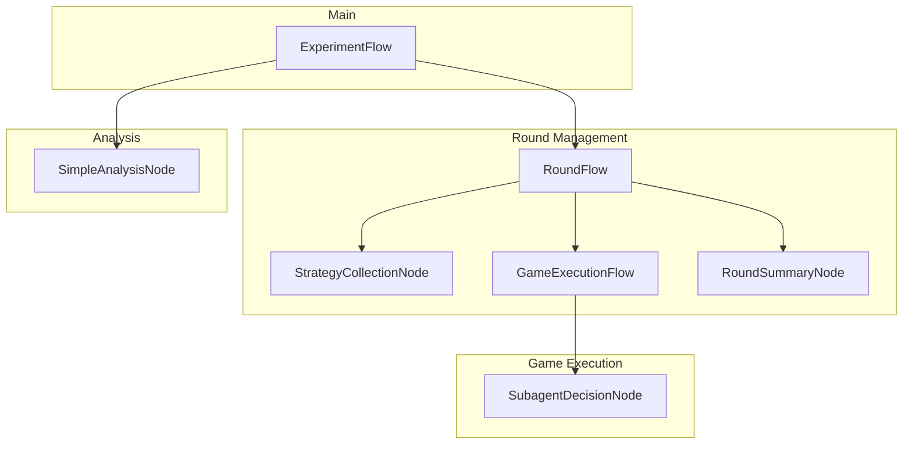

# Component Interactions

## Flow Hierarchy



## Context Flow

The system uses a shared context dictionary that flows through all components:

```python
context = {
    'experiment_id': str,
    'round': int,
    'agents': List[Agent],
    'strategies': List[StrategyRecord],
    'games': List[GameResult],
    'round_summaries': List[RoundSummary],
    'config': Config
}
```
