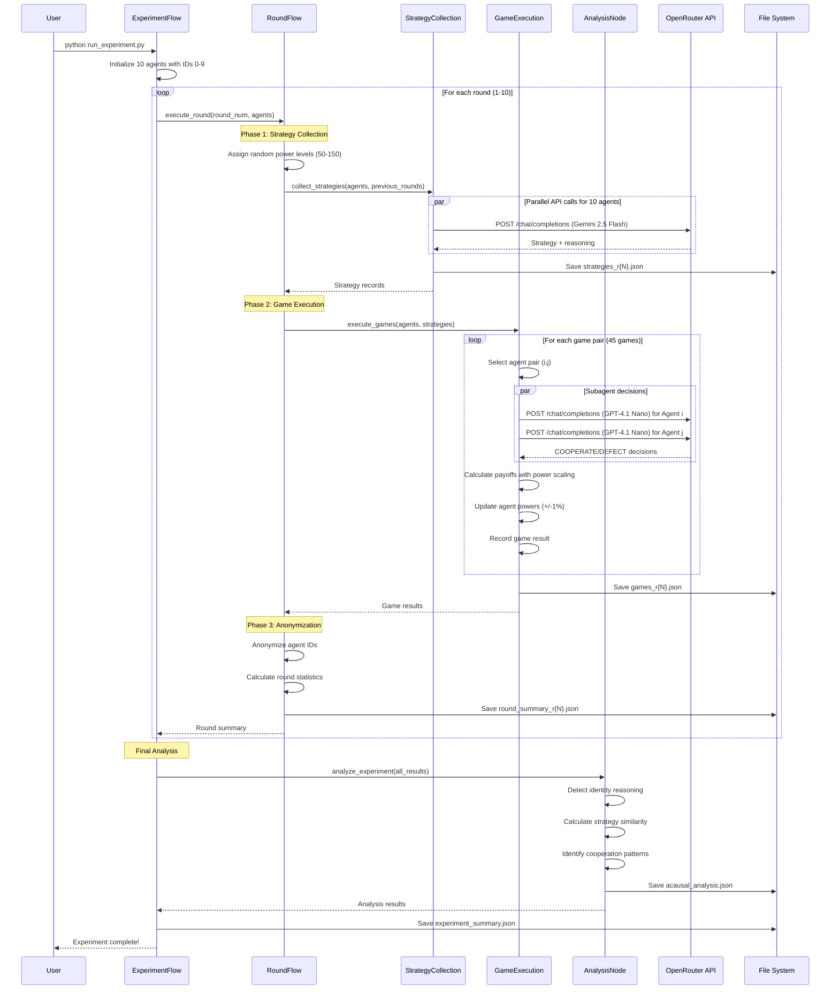
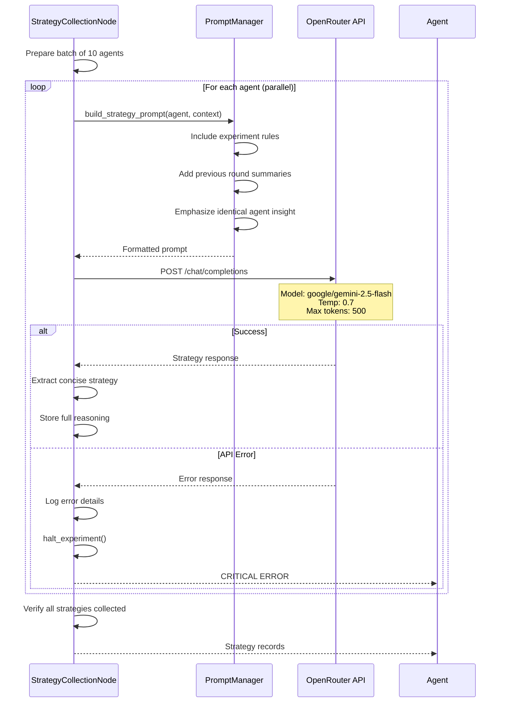
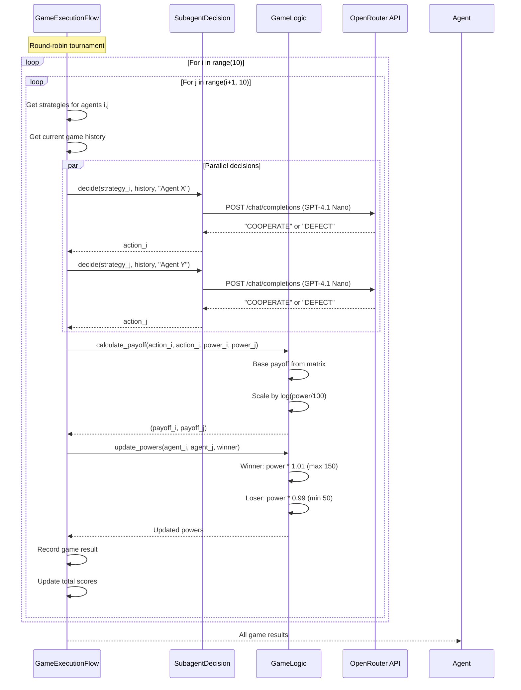
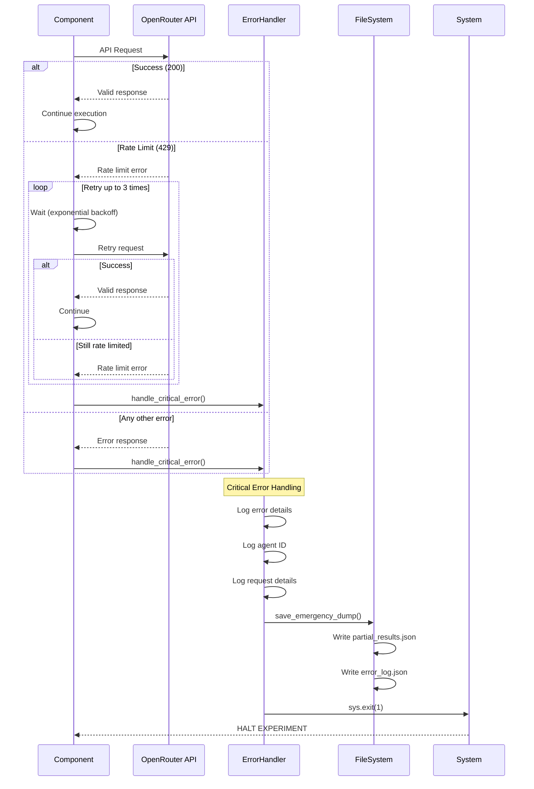

# Core Workflows

## Complete Experiment Flow

```mermaid
sequenceDiagram
    participant User
    participant EF as ExperimentFlow
    participant RF as RoundFlow
    participant SC as StrategyCollection
    participant GE as GameExecution
    participant AN as AnalysisNode
    participant API as OpenRouter API
    participant FS as File System

    User->>EF: python run_experiment.py
    EF->>EF: Initialize 10 agents with IDs 0-9
    
    loop For each round (1-10)
        EF->>RF: execute_round(round_num, agents)
        
        Note over RF: Phase 1: Strategy Collection
        RF->>RF: Assign random power levels (50-150)
        RF->>SC: collect_strategies(agents, previous_rounds)
        
        par Parallel API calls for 10 agents
            SC->>API: POST /chat/completions (Gemini 2.5 Flash)
            API-->>SC: Strategy + reasoning
        end
        
        SC->>FS: Save strategies_r{N}.json
        SC-->>RF: Strategy records
        
        Note over RF: Phase 2: Game Execution
        RF->>GE: execute_games(agents, strategies)
        
        loop For each game pair (45 games)
            GE->>GE: Select agent pair (i,j)
            
            par Subagent decisions
                GE->>API: POST /chat/completions (GPT-4.1 Nano) for Agent i
                GE->>API: POST /chat/completions (GPT-4.1 Nano) for Agent j
                API-->>GE: COOPERATE/DEFECT decisions
            end
            
            GE->>GE: Calculate payoffs with power scaling
            GE->>GE: Update agent powers (+/-1%)
            GE->>GE: Record game result
        end
        
        GE->>FS: Save games_r{N}.json
        GE-->>RF: Game results
        
        Note over RF: Phase 3: Anonymization
        RF->>RF: Anonymize agent IDs
        RF->>RF: Calculate round statistics
        RF->>FS: Save round_summary_r{N}.json
        RF-->>EF: Round summary
    end
    
    Note over EF: Final Analysis
    EF->>AN: analyze_experiment(all_results)
    AN->>AN: Detect identity reasoning
    AN->>AN: Calculate strategy similarity
    AN->>AN: Identify cooperation patterns
    AN->>FS: Save acausal_analysis.json
    AN-->>EF: Analysis results
    
    EF->>FS: Save experiment_summary.json
    EF-->>User: Experiment complete!
```

## Strategy Collection Workflow

```mermaid
sequenceDiagram
    participant SC as StrategyCollectionNode
    participant PM as PromptManager
    participant API as OpenRouter API
    participant Agent
    
    SC->>SC: Prepare batch of 10 agents
    
    loop For each agent (parallel)
        SC->>PM: build_strategy_prompt(agent, context)
        PM->>PM: Include experiment rules
        PM->>PM: Add previous round summaries
        PM->>PM: Emphasize identical agent insight
        PM-->>SC: Formatted prompt
        
        SC->>API: POST /chat/completions
        Note over API: Model: google/gemini-2.5-flash<br/>Temp: 0.7<br/>Max tokens: 500
        
        alt Success
            API-->>SC: Strategy response
            SC->>SC: Extract concise strategy
            SC->>SC: Store full reasoning
        else API Error
            API-->>SC: Error response
            SC->>SC: Log error details
            SC->>SC: halt_experiment()
            SC-->>Agent: CRITICAL ERROR
        end
    end
    
    SC->>SC: Verify all strategies collected
    SC-->>Agent: Strategy records
```

## Game Execution Workflow

```mermaid
sequenceDiagram
    participant GE as GameExecutionFlow
    participant SD as SubagentDecision
    participant GL as GameLogic
    participant API as OpenRouter API
    
    Note over GE: Round-robin tournament
    
    loop For i in range(10)
        loop For j in range(i+1, 10)
            GE->>GE: Get strategies for agents i,j
            GE->>GE: Get current game history
            
            par Parallel decisions
                GE->>SD: decide(strategy_i, history, "Agent X")
                SD->>API: POST /chat/completions (GPT-4.1 Nano)
                API-->>SD: "COOPERATE" or "DEFECT"
                SD-->>GE: action_i
                
                GE->>SD: decide(strategy_j, history, "Agent Y")
                SD->>API: POST /chat/completions (GPT-4.1 Nano)
                API-->>SD: "COOPERATE" or "DEFECT"
                SD-->>GE: action_j
            end
            
            GE->>GL: calculate_payoff(action_i, action_j, power_i, power_j)
            GL->>GL: Base payoff from matrix
            GL->>GL: Scale by log(power/100)
            GL-->>GE: (payoff_i, payoff_j)
            
            GE->>GL: update_powers(agent_i, agent_j, winner)
            GL->>GL: Winner: power * 1.01 (max 150)
            GL->>GL: Loser: power * 0.99 (min 50)
            GL-->>GE: Updated powers
            
            GE->>GE: Record game result
            GE->>GE: Update total scores
        end
    end
    
    GE-->>Agent: All game results
```

## Error Handling Workflow

```mermaid
sequenceDiagram
    participant Component
    participant API as OpenRouter API
    participant EH as ErrorHandler
    participant FS as FileSystem
    participant OS as System
    
    Component->>API: API Request
    
    alt Success (200)
        API-->>Component: Valid response
        Component->>Component: Continue execution
    else Rate Limit (429)
        API-->>Component: Rate limit error
        loop Retry up to 3 times
            Component->>Component: Wait (exponential backoff)
            Component->>API: Retry request
            alt Success
                API-->>Component: Valid response
                Component->>Component: Continue
            else Still rate limited
                API-->>Component: Rate limit error
            end
        end
        Component->>EH: handle_critical_error()
    else Any other error
        API-->>Component: Error response
        Component->>EH: handle_critical_error()
    end
    
    Note over EH: Critical Error Handling
    EH->>EH: Log error details
    EH->>EH: Log agent ID
    EH->>EH: Log request details
    EH->>FS: save_emergency_dump()
    FS->>FS: Write partial_results.json
    FS->>FS: Write error_log.json
    EH->>OS: sys.exit(1)
    OS-->>Component: HALT EXPERIMENT
```
