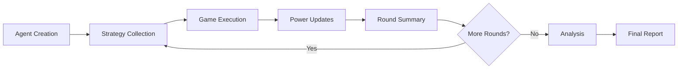

# Data Model Design

## Core Entities

### Agent
**Purpose:** Represents a participant in the experiment

**Attributes:**
- id: int - Unique identifier (0-9)
- power: float - Current power level (50-150)
- strategy: str - Current round strategy
- total_score: float - Accumulated score

### TypeScript Interface
```typescript
interface Agent {
  id: number;
  power: number;
  strategy: string;
  total_score: number;
}
```

### Relationships
- Has many StrategyRecords (one per round)
- Participates in many GameResults

### Validation Rules
- ID must be between 0 and 9
- Power must be between 50 and 150
- Strategy cannot be empty after round 1

---

### GameResult
**Purpose:** Records the outcome of a single prisoner's dilemma game

**Attributes:**
- game_id: str - Unique game identifier
- round: int - Round number (1-10)
- player1_id: int - First player's agent ID
- player2_id: int - Second player's agent ID
- player1_action: str - COOPERATE or DEFECT
- player2_action: str - COOPERATE or DEFECT
- player1_payoff: float - Points earned by player 1
- player2_payoff: float - Points earned by player 2
- player1_power_before: float - Player 1's power before game
- player2_power_before: float - Player 2's power before game
- timestamp: str - ISO timestamp

### TypeScript Interface
```typescript
interface GameResult {
  game_id: string;
  round: number;
  player1_id: number;
  player2_id: number;
  player1_action: "COOPERATE" | "DEFECT";
  player2_action: "COOPERATE" | "DEFECT";
  player1_payoff: number;
  player2_payoff: number;
  player1_power_before: number;
  player2_power_before: number;
  timestamp: string;
}
```

### Relationships
- References two Agents
- Belongs to one Round

### Validation Rules
- Actions must be either "COOPERATE" or "DEFECT"
- Player IDs must be different
- Round must be between 1 and 10

---

### StrategyRecord
**Purpose:** Stores the full strategy reasoning from main agents

**Attributes:**
- strategy_id: str - Unique identifier
- agent_id: int - Agent who created strategy
- round: int - Round number
- strategy_text: str - Extracted strategy
- full_reasoning: str - Complete LLM response
- prompt_tokens: int - Tokens used in prompt
- completion_tokens: int - Tokens in response
- model: str - Model used
- timestamp: str - ISO timestamp

### TypeScript Interface
```typescript
interface StrategyRecord {
  strategy_id: string;
  agent_id: number;
  round: number;
  strategy_text: string;
  full_reasoning: string;
  prompt_tokens: number;
  completion_tokens: number;
  model: string;
  timestamp: string;
}
```

### Relationships
- Belongs to one Agent
- Created once per round

---

### RoundSummary

**Purpose:** Aggregated statistics and anonymized results for a complete round

**Attributes:**
- round: int - Round number (1-10)
- cooperation_rate: float - Percentage of COOPERATE actions
- average_score: float - Mean score across all agents
- score_variance: float - Variance in scores
- power_distribution: dict - Statistics on power levels
- anonymized_games: list - Games with anonymized agent IDs

### TypeScript Interface
```typescript
interface RoundSummary {
  round: number;
  cooperation_rate: number;
  average_score: number;
  score_variance: number;
  power_distribution: {
    mean: number;
    std: number;
    min: number;
    max: number;
  };
  anonymized_games: AnonymizedGameResult[];
}
```

### Relationships
- Has many AnonymizedGameResults
- Belongs to one Experiment

---

### ExperimentResult
**Purpose:** Complete experiment data including all rounds and analysis

**Attributes:**
- experiment_id: str - Unique experiment identifier
- start_time: str - ISO timestamp
- end_time: str - ISO timestamp
- total_rounds: int - Number of rounds completed
- total_games: int - Total games played
- total_api_calls: int - API calls made
- total_cost: float - Estimated cost in USD
- round_summaries: list - All round summaries
- acausal_indicators: dict - Analysis metrics

### TypeScript Interface
```typescript
interface ExperimentResult {
  experiment_id: string;
  start_time: string;
  end_time: string;
  total_rounds: number;
  total_games: number;
  total_api_calls: number;
  total_cost: number;
  round_summaries: RoundSummary[];
  acausal_indicators: {
    identity_reasoning_frequency: number;
    cooperation_despite_asymmetry: number;
    strategy_convergence: number;
    overall_cooperation_rate: number;
    acausal_score: number;
  };
}
```

### Relationships
- Has many RoundSummaries
- Has many StrategyRecords
- Has many GameResults

## Data Flow


