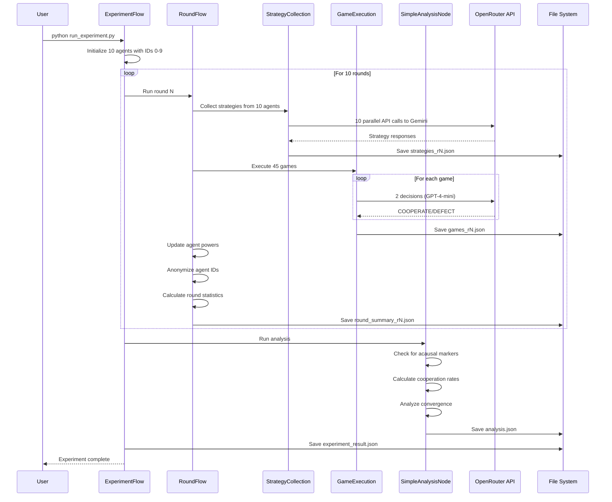

# Detailed Sequence Flows

## Complete Experiment Flow

```mermaid
sequenceDiagram
    participant User
    participant EF as ExperimentFlow
    participant RF as RoundFlow
    participant SC as StrategyCollection
    participant GE as GameExecution
    participant AN as SimpleAnalysisNode
    participant API as OpenRouter API
    participant FS as File System
    
    User->>EF: python run_experiment.py
    EF->>EF: Initialize 10 agents with IDs 0-9
    
    loop For 10 rounds
        EF->>RF: Run round N
        RF->>SC: Collect strategies from 10 agents
        SC->>API: 10 parallel API calls to Gemini
        API-->>SC: Strategy responses
        SC->>FS: Save strategies_rN.json
        
        RF->>GE: Execute 45 games
        loop For each game
            GE->>API: 2 decisions (GPT-4-mini)
            API-->>GE: COOPERATE/DEFECT
        end
        GE->>FS: Save games_rN.json
        
        RF->>RF: Update agent powers
        RF->>RF: Anonymize agent IDs
        RF->>RF: Calculate round statistics
        RF->>FS: Save round_summary_rN.json
    end
    
    EF->>AN: Run analysis
    AN->>AN: Check for acausal markers
    AN->>AN: Calculate cooperation rates
    AN->>AN: Analyze convergence
    AN->>FS: Save analysis.json
    
    EF->>FS: Save experiment_result.json
    EF-->>User: Experiment complete
```
