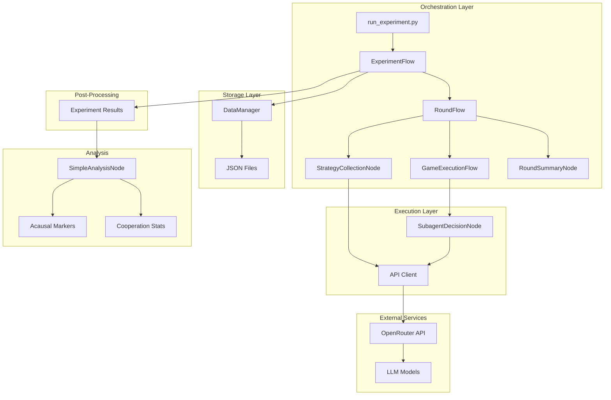

# High Level Architecture

## Technical Summary

The Acausal Cooperation Experiment employs a modular Python-based architecture using an async flow framework to orchestrate prisoner's dilemma tournaments between LLM agents. The system leverages OpenRouter API for LLM access, implements a hierarchical node-based execution pattern for experiment orchestration, and outputs comprehensive JSON datasets for analysis. The architecture prioritizes simplicity, clear separation of concerns, and robust data collection to enable statistical analysis of superrational cooperation patterns. This design achieves the PRD goals by providing a controlled experimental environment with minimal external dependencies.

## Platform and Infrastructure Choice

**Platform:** Local Python Environment with Cloud API Access
- Chosen for rapid development and iteration
- No infrastructure management overhead
- Direct control over execution and debugging

**API Provider:** OpenRouter
- Unified access to multiple LLM models through single API
- Simplified billing and rate limiting
- Consistent interface across different model providers

**Storage:** Local JSON Files
- Simple, human-readable format
- No database complexity for small datasets
- Easy version control and sharing

## System Architecture Diagram

## Architectural Patterns

1. **Node-Based Execution**: Each major operation is encapsulated in a node with standard interfaces
2. **Async/Await Concurrency**: Parallel API calls for strategy collection
3. **Flow Orchestration**: Hierarchical flows manage complex multi-step processes
4. **Separation of Concerns**: Clear boundaries between orchestration, execution, and storage
