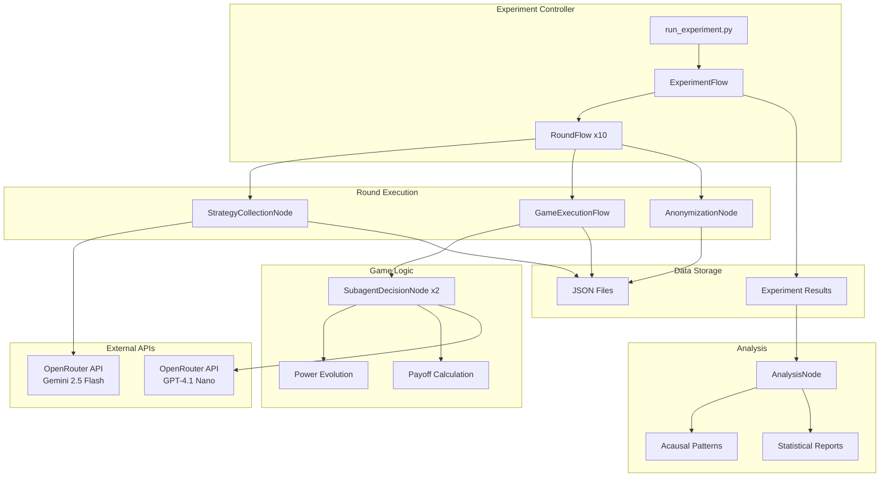

# High Level Architecture

## Technical Summary

The Acausal Cooperation Experiment employs a modular Python-based architecture using an async flow framework to orchestrate prisoner's dilemma tournaments between LLM agents. The system leverages OpenRouter API for multi-model LLM access, implements a hierarchical node-based execution pattern for experiment orchestration, and outputs comprehensive JSON datasets for analysis. The architecture prioritizes simplicity, clear separation of concerns, and robust data collection to enable statistical analysis of superrational cooperation patterns. This design achieves the PRD goals by providing a controlled experimental environment with minimal external dependencies while maintaining flexibility for future experiments.

## Platform and Infrastructure Choice

**Platform:** Local Python Environment with Cloud API Access
**Key Services:** OpenRouter API (LLM access), Local filesystem (data storage), Python async runtime
**Deployment Host and Regions:** Local development machine with internet access for API calls

## Repository Structure

**Structure:** Single Python Project (Simple Structure)
**Monorepo Tool:** N/A - Single project structure
**Package Organization:** Modular Python packages organized by functionality (nodes, flows, analysis)

## High Level Architecture Diagram

## Architectural Patterns

- **Async Flow Pattern:** Hierarchical async flows orchestrate experiment phases - _Rationale:_ Enables parallel API calls and clean separation of experiment phases
- **Node-Based Architecture:** Each logical operation encapsulated in a node class - _Rationale:_ Promotes reusability, testability, and clear boundaries between components
- **Strategy-Executor Separation:** Main agents create strategies, subagents execute them - _Rationale:_ Mimics real-world delegation and prevents direct game-playing by strategy agents
- **Immutable Game History:** Append-only game records with anonymization layer - _Rationale:_ Ensures experimental integrity while protecting agent identity for unbiased decisions
- **JSON-First Data Storage:** All outputs stored as structured JSON files - _Rationale:_ Enables easy analysis with standard tools and preserves complete experimental data
- **Stateless API Integration:** Each API call is independent with retry logic - _Rationale:_ Handles API failures gracefully without corrupting experiment state
