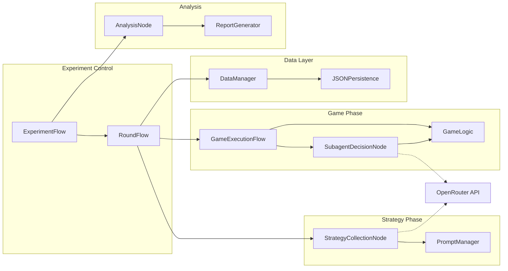

# Interpretation
{"Strong evidence" if acausal_indicators['overall_score'] > 0.7 else "Moderate evidence" if acausal_indicators['overall_score'] > 0.4 else "Weak evidence"} of acausal cooperation.
"""
    
    with open(f"{output_path}/analysis_report.txt", "w") as f:
        f.write(report)
    
    return analysis_results
```

## Component Interaction Diagram


