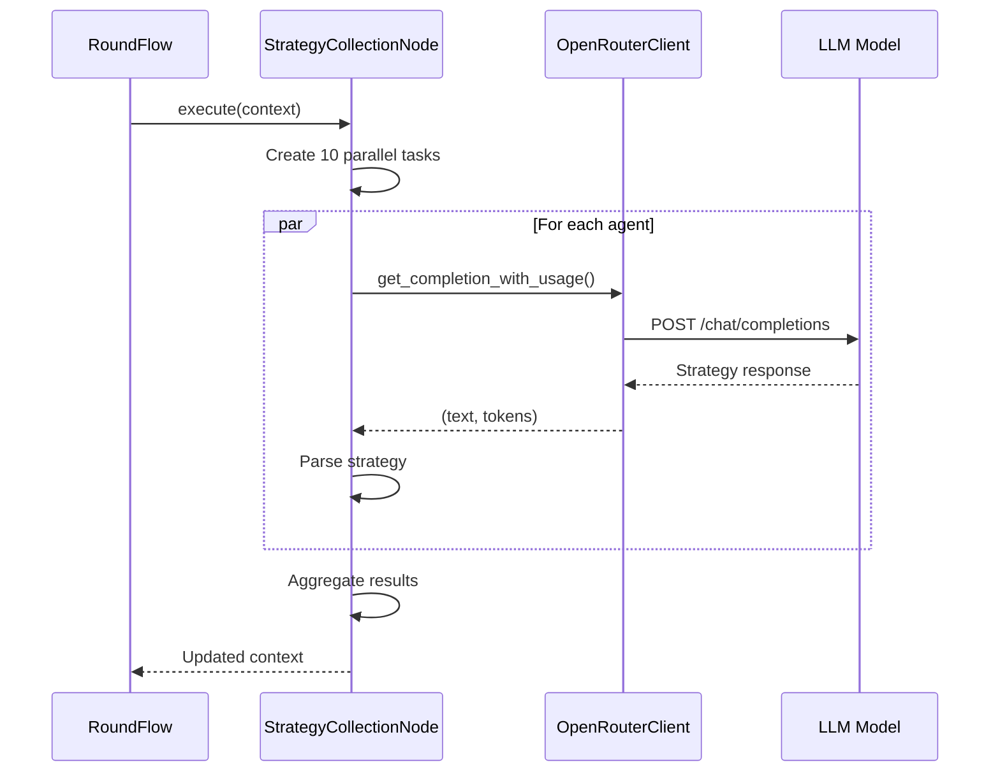
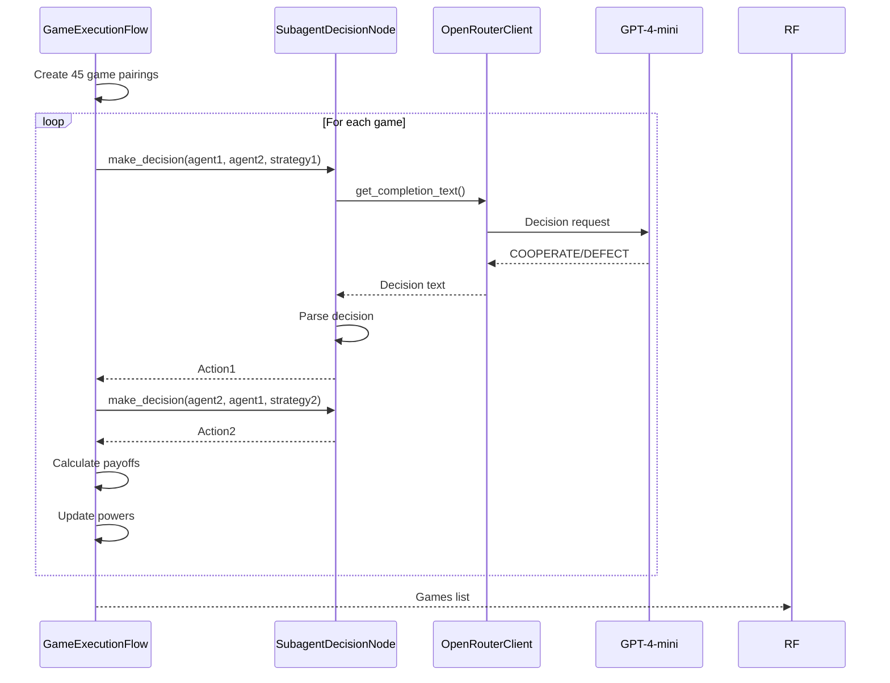
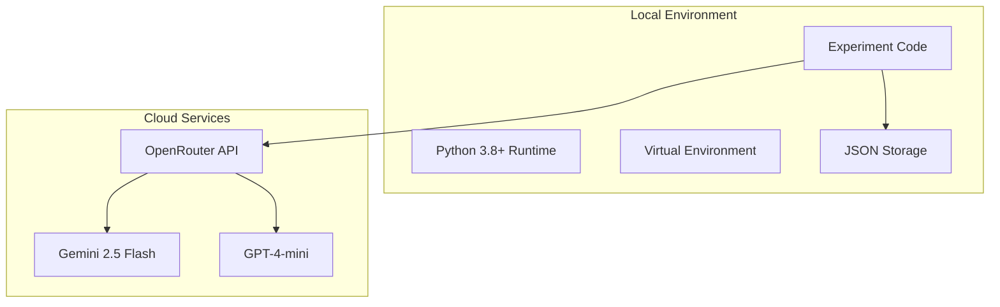
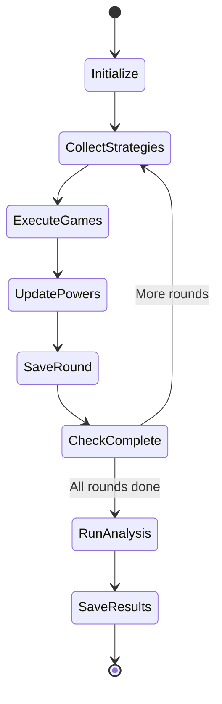

# Technical Architecture

## Sequence Diagrams

### Strategy Collection Sequence

```mermaid
sequenceDiagram
    participant RF as RoundFlow
    participant SC as StrategyCollectionNode
    participant API as OpenRouterClient
    participant LLM as LLM Model
    
    RF->>SC: execute(context)
    SC->>SC: Create 10 parallel tasks
    par For each agent
        SC->>API: get_completion_with_usage()
        API->>LLM: POST /chat/completions
        LLM-->>API: Strategy response
        API-->>SC: (text, tokens)
        SC->>SC: Parse strategy
    end
    SC->>SC: Aggregate results
    SC-->>RF: Updated context
```

### Game Execution Sequence

```mermaid
sequenceDiagram
    participant GE as GameExecutionFlow
    participant SD as SubagentDecisionNode
    participant API as OpenRouterClient
    participant LLM as GPT-4-mini
    
    GE->>GE: Create 45 game pairings
    loop For each game
        GE->>SD: make_decision(agent1, agent2, strategy1)
        SD->>API: get_completion_text()
        API->>LLM: Decision request
        LLM-->>API: COOPERATE/DEFECT
        API-->>SD: Decision text
        SD->>SD: Parse decision
        SD-->>GE: Action1
        
        GE->>SD: make_decision(agent2, agent1, strategy2)
        SD-->>GE: Action2
        
        GE->>GE: Calculate payoffs
        GE->>GE: Update powers
    end
    GE-->>RF: Games list
```

## Deployment Architecture

```mermaid
graph TB
    subgraph "Local Environment"
        A[Python 3.8+ Runtime]
        B[Virtual Environment]
        C[Experiment Code]
        D[JSON Storage]
    end
    
    subgraph "Cloud Services"
        E[OpenRouter API]
        F[Gemini 2.5 Flash]
        G[GPT-4-mini]
    end
    
    C --> E
    E --> F
    E --> G
    C --> D
```

## State Flow

```mermaid
stateDiagram-v2
    [*] --> Initialize
    Initialize --> CollectStrategies
    CollectStrategies --> ExecuteGames
    ExecuteGames --> UpdatePowers
    UpdatePowers --> SaveRound
    SaveRound --> CheckComplete
    CheckComplete --> CollectStrategies: More rounds
    CheckComplete --> RunAnalysis: All rounds done
    RunAnalysis --> SaveResults
    SaveResults --> [*]
```
